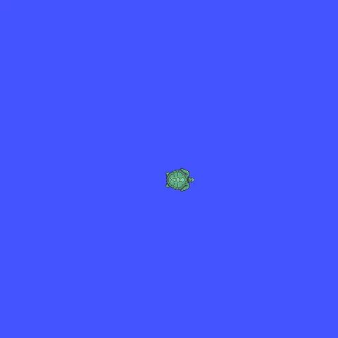

# susumu_agent

> [!WARNING]
> **注意：このリポジトリは生成AIで適当に作ってます。**

自然言語（日本語・英語）でロボットを制御するシステム。  
Google ADK + Gemini（または Claude on Vertex AI）が音声・テキストの指示を ROS2 `/cmd_vel` コマンドに変換する。



設計・アーキテクチャの詳細は [Design.md](docs/Design.md) を参照。

---

## 目次

- [セットアップ](#セットアップ)
- [launch ファイル一覧](#launch-ファイル一覧)
- [コマンド例](#コマンド例)
- [テスト](#テスト)
- [ライセンス](#ライセンス)

---

## セットアップ

**前提条件:**
- Python 3.10 以上
- Google Cloud プロジェクト（Vertex AI 有効化済み）
- `gcloud auth application-default login` 済み

**1. クローン**

```bash
git clone https://github.com/sato-susumu/susumu_agent.git
cd susumu_agent
```

**2. 依存パッケージのインストール**

```bash
uv sync
```

**3. 認証情報の設定**

```bash
cp .env.sample .env
```

`.env` を編集して GCP プロジェクト ID を設定する:

```dotenv
GOOGLE_CLOUD_PROJECT=your-gcp-project-id
```

**4. （ROS2 環境の場合）ビルド**

```bash
colcon build --packages-select susumu_agent
source install/setup.bash
```

**5. 起動**

```bash
# シミュレーションモード（ROS2 不要）
python3 -m susumu_agent

# turtlesim デモ（ROS2 必要）
ros2 launch susumu_agent turtlesim_demo.launch.py
```

ROS2 launch 経由で起動した場合、ADK への入力は端末の `input()` ではなく `/from_human` トピックで受け取る。

```bash
ros2 topic pub --once /from_human std_msgs/msg/String "{data: 'ゆっくり前進して'}"
ros2 topic echo /to_human
```

`cmd_vel_stamped:=true` で `geometry_msgs/msg/TwistStamped`、`false` で `geometry_msgs/msg/Twist` を使う。turtlesim 系 launch は `false`、それ以外は `true` がデフォルト。

`turtlesim_demo*.launch.py` では `susumu_agent_demo_feeder` がデモ入力を `/from_human` に流す。正方形デモの途中で `ストップ` を1回だけ割り込ませ、最後の `/to_human` 応答後は `final_hold_sec` 秒だけ待ってから終了する。デフォルトは `5.0` 秒。

---

## ROS2 トピック

### サブスクライブ（入力）

| トピック | 型 | 説明 |
|---|---|---|
| `/from_human` | `std_msgs/msg/String` | 人間から ADK へ渡す自然言語入力（ROS2 launch 時） |
| `/camera/image_raw` | `sensor_msgs/msg/Image` | カメラ画像 |

### パブリッシュ（出力）

| トピック | 型 | 説明 |
|---|---|---|
| `/to_human` | `std_msgs/msg/String` | ADK の最終応答のうち、人間に見せる文字列 |
| `/cmd_vel` | `geometry_msgs/msg/Twist` または `geometry_msgs/msg/TwistStamped` | ロボットへの速度指令 |

---

## launch ファイル一覧

| ファイル | 説明 | cmd_vel 型 | ROS2 必要 | デバッグモード | 自動終了 |
|---|---|---|:---:|:---:|:---:|
| `mock.launch.py` | MockRobot・インタラクティブ操作 | `TwistStamped` | — | — | — |
| `mock_debug.launch.py` | MockRobot・インタラクティブ操作 | `TwistStamped` | — | ✓ | — |
| `real.launch.py` | 実機・インタラクティブ操作 | `TwistStamped` | ✓ | — | — |
| `real_debug.launch.py` | 実機・インタラクティブ操作 | `TwistStamped` | ✓ | ✓ | — |
| `turtlesim.launch.py` | turtlesim・インタラクティブ操作 | `Twist` | ✓ | — | — |
| `turtlesim_debug.launch.py` | turtlesim・インタラクティブ操作 | `Twist` | ✓ | ✓ | — |
| `turtlesim_demo.launch.py` | turtlesim・自動デモ（feeder が `/from_human` に入力） | `Twist` | ✓ | — | ✓ |
| `turtlesim_demo_debug.launch.py` | turtlesim・自動デモ（feeder が `/from_human` に入力） | `Twist` | ✓ | ✓ | ✓ |

---

## コマンド例

| 入力例 | 動作 |
|---|---|
| `ゆっくり前進` | 0.1 m/s で 2 秒前進 |
| `素早く前進` | 0.5 m/s で 2 秒前進 |
| `3秒前進して` | 0.3 m/s で 3 秒前進 |
| `1メートル進んで` | 距離から時間を自動計算して前進 |
| `後退` | 0.3 m/s で 2 秒後退 |
| `右向いて` | 右に 90 度旋回 |
| `左向いて` | 左に 90 度旋回 |
| `180度回転して` | その場で 180 度旋回 |
| `三角形を描いて` | 前進 → 120 度旋回 を 3 回繰り返す |
| `四角形を描いて` | 前進 → 90 度旋回 を 4 回繰り返す |
| `何が見える？` | カメラで前方を確認（実機モードのみ有効） |
| `状態確認` | 現在の移動状態を確認 |
| `ヘルプ` | 使い方を表示 |
| `ストップ` | 即時緊急停止（LLM 経由なし） |

---

## テスト

```bash
pytest
```

---

## ライセンス

MIT
