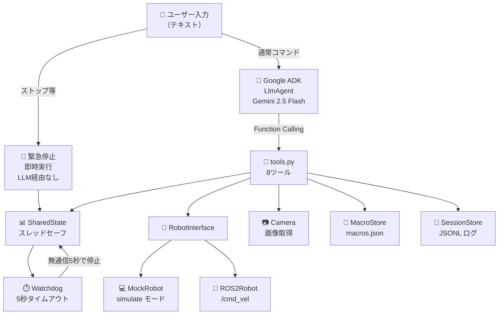
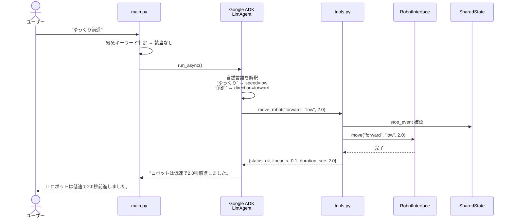
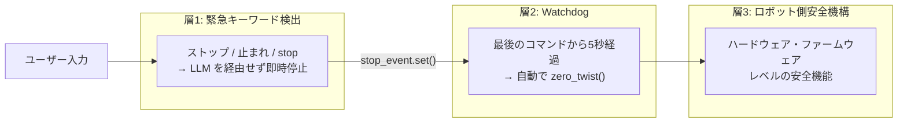
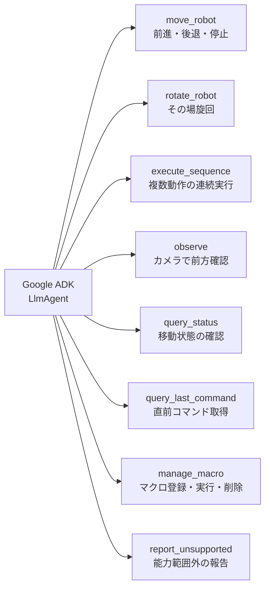
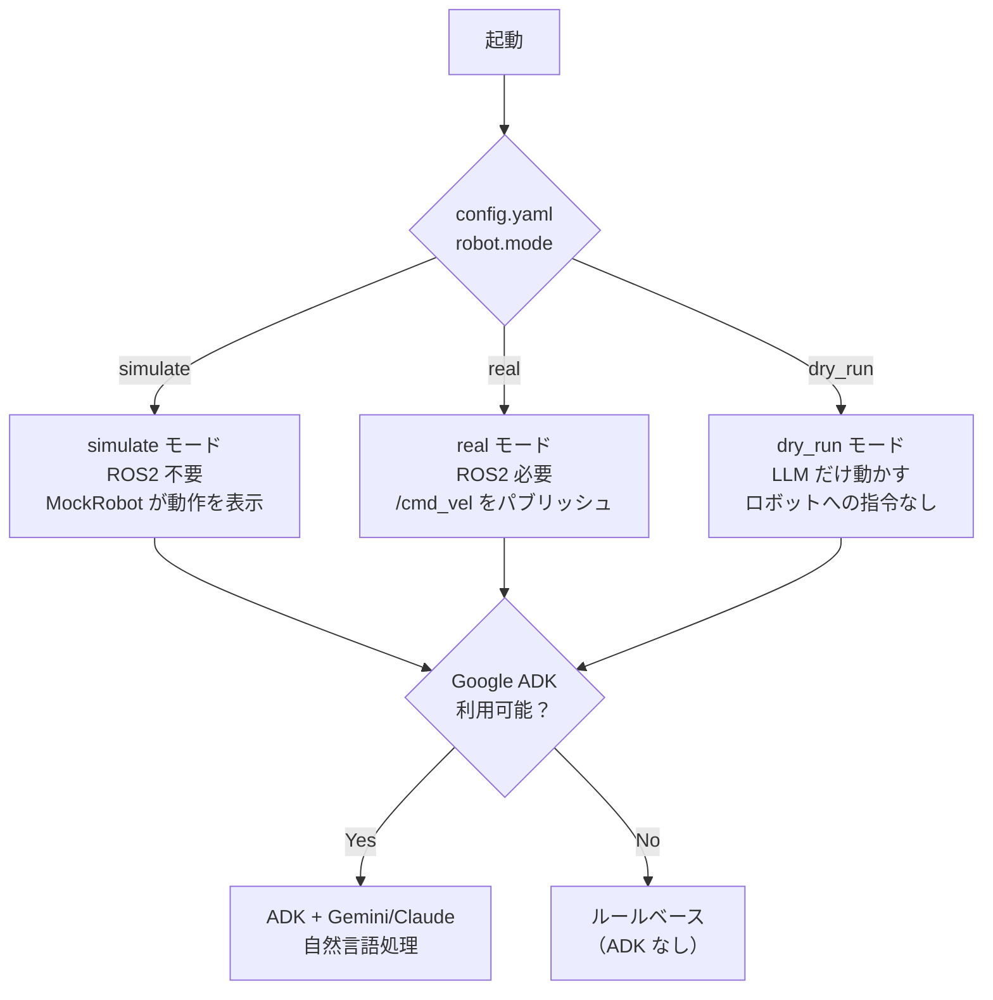
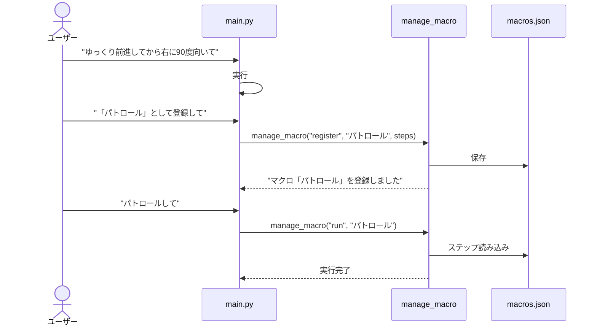

# susumu_agent

自然言語（日本語・英語）でロボットを制御するシステム。  
Google ADK + Gemini（または Claude on Vertex AI）が音声・テキストの指示を ROS2 `/cmd_vel` コマンドに変換する。

---

## システム全体構成



---

## データフロー



---

## 安全設計



---

## ツール一覧



---

## 速度マッピング

| レベル | キーワード例 | linear (m/s) | angular (rad/s) |
|---|---|---|---|
| `low` | ゆっくり、slowly | 0.1 | 0.3 |
| `medium` | （指定なし） | 0.3 | 0.8 |
| `high` | 速く、fast | 0.5 | 1.5 |

---

## モード切り替え



---

## ファイル構成

```mermaid
graph TD
    Root["robot_nl_controller/"]

    Root --> main["main.py<br/>エントリポイント・入力ループ"]
    Root --> agent["agent.py<br/>ADK LlmAgent 設定"]
    Root --> tools["tools.py<br/>8ツール実装"]
    Root --> cap["capabilities.py<br/>速度定数・プロンプト生成"]
    Root --> state["shared_state.py<br/>スレッドセーフ共有状態"]
    Root --> wd["watchdog.py<br/>タイムアウト監視"]
    Root --> cam["camera.py<br/>画像取得"]
    Root --> ss["session_store.py<br/>履歴ログ"]
    Root --> ms["macro_store.py<br/>マクロ保存"]
    Root --> cfg["config.yaml<br/>全設定"]

    Root --> robotdir["robot/"]
    robotdir --> iface["interface.py<br/>抽象クラス"]
    robotdir --> mock["mock_robot.py<br/>simulate 用"]
    robotdir --> ros2["ros2_robot.py<br/>実機用"]

    Root --> launch["launch/"]
    launch --> lreal["robot_nl.launch.py<br/>実機用"]
    launch --> lsim["robot_nl_simulate.launch.py<br/>simulate 用"]

    Root --> deploy["deploy/"]
    deploy --> svc["robot-nl.service<br/>systemd unit"]
    deploy --> inst["install.sh<br/>デプロイスクリプト"]

    Root --> voice["voice/"]
    voice --> rec["recognizer.py<br/>音声認識 抽象クラス"]
    voice --> syn["synthesizer.py<br/>音声合成 抽象クラス"]
```



---

## セットアップ

### 前提

| 項目 | バージョン |
|---|---|
| Python | 3.10 以上 |
| ROS2 | Humble（実機モードのみ必要） |
| Google Cloud | Vertex AI が有効なプロジェクト |
| 認証 | `gcloud auth application-default login` 済み |

### インストール

```bash
cd robot_nl_controller
pip install -r requirements.txt
```

> `rclpy` / `geometry_msgs` / `sensor_msgs` は ROS2 インストールに含まれるため pip 不要。

### config.yaml の主要設定

```yaml
robot:
  mode: "simulate"        # simulate / real / dry_run

llm:
  model: "gemini-2.5-flash"       # 使用モデル（下記参照）
  project: "your-gcp-project-id"  # GCP プロジェクト ID
  location: "us-central1"
  timeout_sec: 60

interface:
  verbosity: "normal"     # brief / normal / verbose
```

**使用できるモデル:**

| モデル文字列 | 説明 | 前提条件 |
|---|---|---|
| `gemini-2.5-flash` | Gemini 2.5 Flash（デフォルト） | Vertex AI 有効化のみ |
| `gemini-2.5-pro` | Gemini 2.5 Pro（高精度） | Vertex AI 有効化のみ |
| `claude-sonnet-4-5@20250514` | Claude Sonnet | Vertex AI Model Garden で Claude を有効化 |

---

## 起動方法

### シミュレーションモード（ROS2 不要）

```bash
cd robot_nl_controller
python3 main.py
```

### 実機モード（ROS2 必要）

```bash
# config.yaml の robot.mode を "real" に変更してから:
python3 main.py

# ROS2 launch 経由:
ros2 launch robot_nl_controller robot_nl.launch.py

# 設定ファイルを指定:
ros2 launch robot_nl_controller robot_nl.launch.py config_path:=/path/to/config.yaml
```

### 自動起動（systemd）

```bash
sudo bash deploy/install.sh
sudo nano /etc/robot_nl/secrets.env   # GCP 情報を記入
sudo systemctl start robot-nl
sudo journalctl -u robot-nl -f
```

---

## 使い方

起動するとプロンプトが表示される。

```
あなた: ゆっくり前進
  [考え中...]
  [MockRobot] forward linear_x=0.10 m/s × 2.0s 開始
  [MockRobot] forward 完了 → 停止

🤖 ロボットは低速で2.0秒前進しました。
```

### コマンド例

| 入力例 | 動作 |
|---|---|
| `ゆっくり前進` | 0.1 m/s で 2 秒前進 |
| `素早く前進` | 0.5 m/s で 2 秒前進 |
| `3秒前進して` | 0.3 m/s で 3 秒前進 |
| `1メートル進んで` | 距離から時間を自動計算して前進 |
| `後退` | 0.3 m/s で 2 秒後退 |
| `右向いて` | 右に 90 度旋回 |
| `左向いて` | 左に 90 度旋回 |
| `180度回転して` | その場で 180 度旋回 |
| `三角形を描いて` | 前進 → 120 度旋回 を 3 回繰り返す |
| `四角形を描いて` | 前進 → 90 度旋回 を 4 回繰り返す |
| `何が見える？` | カメラで前方を確認（実機モードのみ有効） |
| `状態確認` | 現在の移動状態を確認 |
| `ヘルプ` | 使い方を表示 |
| `ストップ` | 即時緊急停止（LLM 経由なし） |
| `quit` | 終了 |

### マクロ機能



---

## 能力定義のカスタマイズ

`capabilities.py` を編集するとロボットの能力定義を変更できる。変更後はシステムプロンプトに自動で反映される。

```python
# 速度の変更
SPEED_MAP = {
    "low":    {"linear": 0.05, "angular": 0.2},
    "medium": {"linear": 0.2,  "angular": 0.6},
    "high":   {"linear": 0.4,  "angular": 1.2},
}

# 緊急停止キーワードの追加
EMERGENCY_KEYWORDS = {
    "ストップ", "止まれ", "stop",
    "危ない",   # 追加例
}
```

---

## テスト

```bash
~/.local/bin/pytest tests/unit/ -v
```

---

## 音声インターフェースの追加

`voice/` の抽象クラスを継承して実装し、`main.py` の `input()` を差し替える。

```python
# voice/my_recognizer.py
from voice.recognizer import BaseRecognizer

class MyRecognizer(BaseRecognizer):
    async def recognize(self) -> str:
        return your_stt_api.transcribe()
```

---

## トラブルシューティング

### ADK 初期化失敗

1. `pip install google-adk` でパッケージを確認
2. `config.yaml` の `llm.project` に正しい GCP プロジェクト ID を設定
3. `gcloud auth application-default login` で認証を確認

### Claude が 404 エラー

Vertex AI Model Garden で Claude の利用を有効化する必要がある。  
有効化するまでは `config.yaml` の `llm.model` を `gemini-2.5-flash` にする。

### Watchdog が誤作動する

`config.yaml` の `robot.watchdog_timeout_sec` を大きくする（デフォルト: `5.0`）。

### ロボットが動かない（実機モード）

```bash
ros2 topic list | grep cmd_vel   # トピックの存在確認
ros2 topic echo /cmd_vel         # 値が届いているか確認
```

---

## ライセンス

MIT
