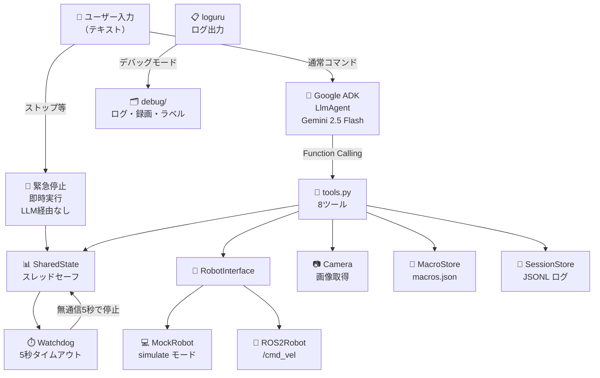
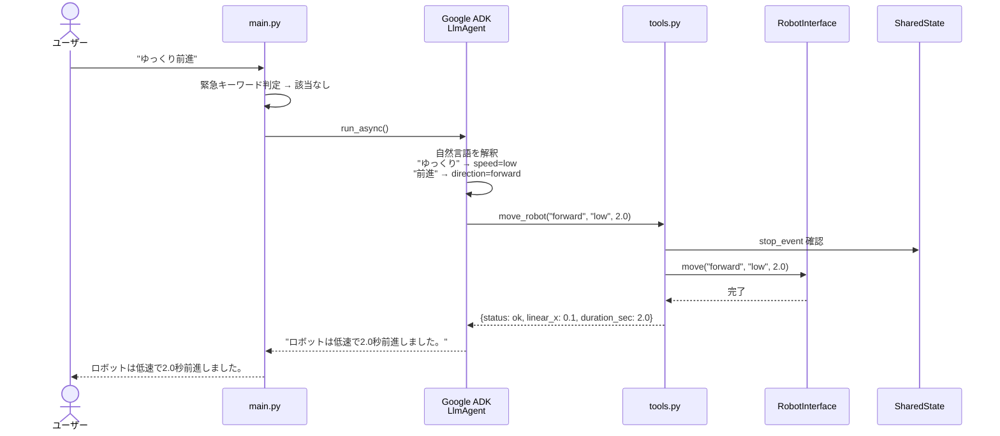
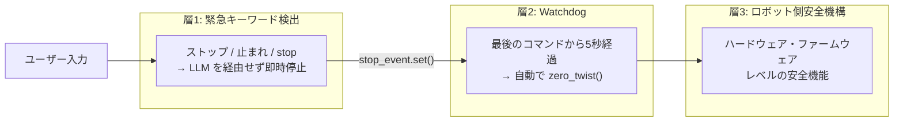
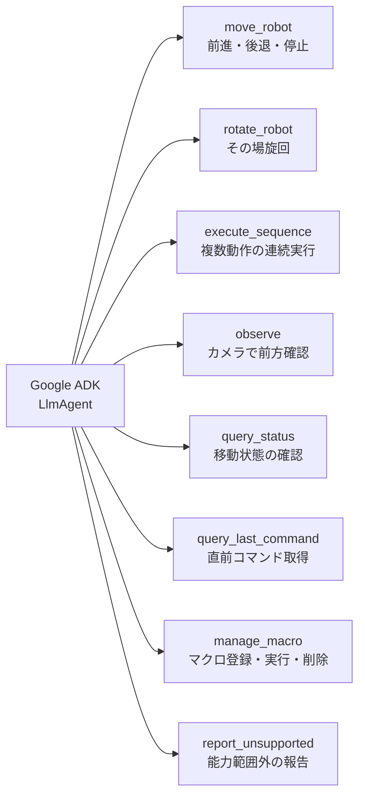
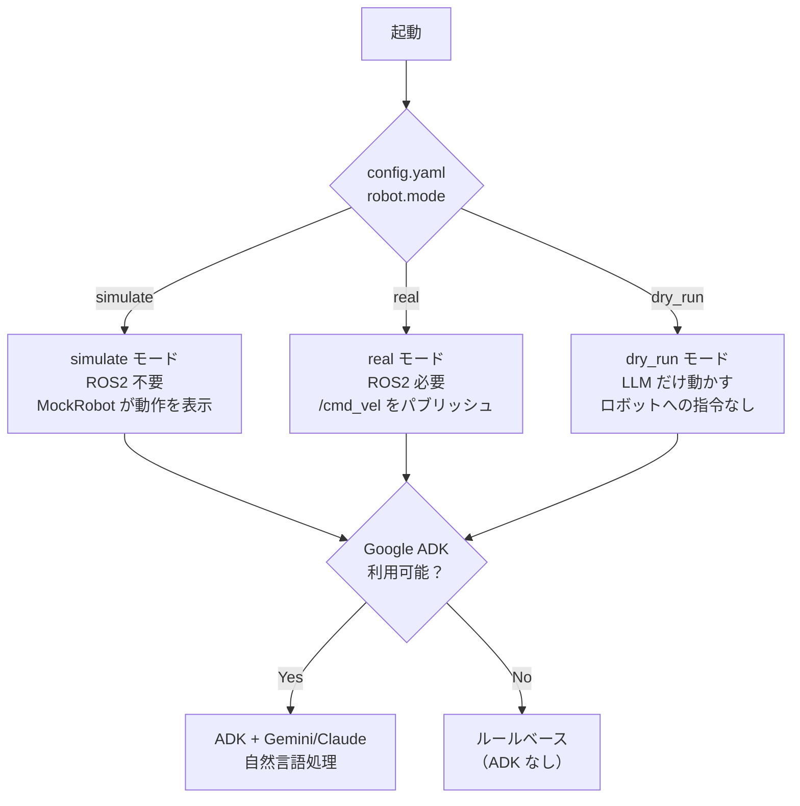

# susumu_agent

> [!WARNING]
> **注意：このリポジトリは生成AIで適当に作ってます。**

自然言語（日本語・英語）でロボットを制御するシステム。  
Google ADK + Gemini（または Claude on Vertex AI）が音声・テキストの指示を ROS2 `/cmd_vel` コマンドに変換する。


---

## システム全体構成



---

## データフロー



---

## 安全設計



---

## ツール一覧



---

## 速度マッピング

| レベル | キーワード例 | linear (m/s) | angular (rad/s) |
|---|---|---|---|
| `low` | ゆっくり、slowly | 0.1 | 0.3 |
| `medium` | （指定なし） | 0.3 | 0.8 |
| `high` | 速く、fast | 0.5 | 1.5 |

---

## モード切り替え



---

## セットアップ

### 前提

| 項目 | バージョン |
|---|---|
| Python | 3.10 以上 |
| ROS2 | Humble（実機モードのみ必要） |
| Google Cloud | Vertex AI が有効なプロジェクト |
| 認証 | `gcloud auth application-default login` 済み |

### インストール

```bash
~/.local/bin/uv sync
```

> `rclpy` / `geometry_msgs` / `sensor_msgs` は ROS2 インストールに含まれるため pip 不要。  
> `uv` 未インストールの場合は `curl -LsSf https://astral.sh/uv/install.sh | sh` で導入。

### 認証情報の設定（.env）

プロジェクトルートに `.env` を作成する（`.env.sample` をコピーして編集）:

```bash
cp .env.sample .env
```

```dotenv
GOOGLE_CLOUD_PROJECT=your-gcp-project-id
GOOGLE_CLOUD_LOCATION=us-central1
ROBOT_MODEL=gemini-2.5-flash
```

`.env` は `.gitignore` で除外されているためリポジトリには含まれない。

### config.yaml の主要設定

```yaml
robot:
  mode: "simulate"        # simulate / real / dry_run

llm:
  model: "gemini-2.5-flash"  # .env の ROBOT_MODEL で上書き可
  project: ""                # .env の GOOGLE_CLOUD_PROJECT で上書き
  location: "us-central1"
  timeout_sec: 60
```

**使用できるモデル:**

| モデル文字列 | 説明 | 前提条件 |
|---|---|---|
| `gemini-2.5-flash` | Gemini 2.5 Flash（デフォルト） | Vertex AI 有効化のみ |
| `gemini-2.5-pro` | Gemini 2.5 Pro（高精度） | Vertex AI 有効化のみ |
| `claude-sonnet-4-5@20250514` | Claude Sonnet | Vertex AI Model Garden で Claude を有効化 |

---

## 起動方法

### シミュレーションモード（ROS2 不要）

```bash
python3 -m susumu_agent.main
```

### launch ファイル一覧

| ファイル | 説明 |
|---|---|
| `mock.launch.py` | MockRobot（ROS2 なしでも可） |
| `mock_debug.launch.py` | MockRobot + デバッグモード |
| `real.launch.py` | 実機（ROS2 必要） |
| `real_debug.launch.py` | 実機 + デバッグモード |
| `turtlesim.launch.py` | turtlesim + インタラクティブ操作 |
| `turtlesim_debug.launch.py` | turtlesim + インタラクティブ操作 + デバッグモード |
| `turtlesim_demo.launch.py` | turtlesim + 自動デモ（完了後自動終了） |
| `turtlesim_demo_debug.launch.py` | turtlesim + 自動デモ + デバッグモード（完了後自動終了） |

```bash
# MockRobot で起動
ros2 launch susumu_agent mock.launch.py

# turtlesim でインタラクティブに操作
ros2 launch susumu_agent turtlesim.launch.py

# turtlesim で自動デモ実行（完了後自動終了）
ros2 launch susumu_agent turtlesim_demo.launch.py

# デバッグモードで自動デモ（ログ・ラベル・録画を debug/ に保存）
ros2 launch susumu_agent turtlesim_demo_debug.launch.py
```

### デバッグモード

`debug:=true` を付けるか `_debug.launch.py` を使うと以下が `debug/` フォルダに生成される:

| ファイル | 内容 |
|---|---|
| `{ts}_susumu_agent.log` | loguru ログ（通常ノード） |
| `{ts}_susumu_agent_demo.log` | loguru ログ（デモノード） |
| `{ts}_command_log.jsonl` | ツール呼び出し履歴 |
| `{ts}_demo_labels.jsonl` | 指示・応答のラベル情報（デモ時のみ） |
| `{ts}_turtlesim_raw.mp4` | turtlesim 元録画（デモ時のみ） |
| `{ts}_turtlesim.srt` | 字幕ファイル・日本語＋英語（デモ時のみ） |
| `{ts}_turtlesim.mp4` | 字幕付き動画（デモ時のみ） |
| `{ts}_turtlesim.gif` | アニメーション GIF・320px（デモ時のみ） |

```bash
# デバッグモードを明示指定
ros2 launch susumu_agent turtlesim_demo.launch.py debug:=true

# debug_dir を変更
ros2 launch susumu_agent turtlesim_demo_debug.launch.py debug_dir:=/tmp/mydbg
```

### LLM なしでツールを直接テスト

```bash
python3 -m susumu_agent.debug_tools move forward medium 2.0
python3 -m susumu_agent.debug_tools rotate 90 medium
python3 -m susumu_agent.debug_tools sequence square
python3 -m susumu_agent.debug_tools --real --cmd-vel-topic /turtle1/cmd_vel move forward medium 2.0
```

---

## 使い方

起動するとプロンプトが表示される。

```
あなた: ゆっくり前進
10:00:01 [INFO] 入力: 'ゆっくり前進'
10:00:03 [INFO] [MockRobot] forward linear_x=0.10 m/s × 2.0s 開始
10:00:05 [INFO] 応答: ロボットは低速で2.0秒前進しました。

ロボットは低速で2.0秒前進しました。
```

### コマンド例

| 入力例 | 動作 |
|---|---|
| `ゆっくり前進` | 0.1 m/s で 2 秒前進 |
| `素早く前進` | 0.5 m/s で 2 秒前進 |
| `3秒前進して` | 0.3 m/s で 3 秒前進 |
| `1メートル進んで` | 距離から時間を自動計算して前進 |
| `後退` | 0.3 m/s で 2 秒後退 |
| `右向いて` | 右に 90 度旋回 |
| `左向いて` | 左に 90 度旋回 |
| `180度回転して` | その場で 180 度旋回 |
| `三角形を描いて` | 前進 → 120 度旋回 を 3 回繰り返す |
| `四角形を描いて` | 前進 → 90 度旋回 を 4 回繰り返す |
| `何が見える？` | カメラで前方を確認（実機モードのみ有効） |
| `状態確認` | 現在の移動状態を確認 |
| `ヘルプ` | 使い方を表示 |
| `ストップ` | 即時緊急停止（LLM 経由なし） |
| `quit` | 終了 |

---

## 能力定義のカスタマイズ

`susumu_agent/capabilities.py` を編集するとロボットの能力定義を変更できる。変更後はシステムプロンプトに自動で反映される。

```python
# 速度の変更
SPEED_MAP = {
    "low":    {"linear": 0.05, "angular": 0.2},
    "medium": {"linear": 0.2,  "angular": 0.6},
    "high":   {"linear": 0.4,  "angular": 1.2},
}

# 緊急停止キーワードの追加
EMERGENCY_KEYWORDS = {
    "ストップ", "止まれ", "stop",
    "危ない",   # 追加例
}
```

---

## テスト

```bash
~/.local/bin/pytest tests/unit/ -v
```

---

## ファイル構成

```
susumu_agent/
├── config.yaml               # 全設定（トピック名・モデル・モード等）
├── .env                      # 認証情報（gitignore 対象）
├── .env.sample               # .env のテンプレート
├── debug/                    # デバッグ出力先（gitignore 対象）
├── requirements.txt          # pip インストール可能パッケージ
├── launch/
│   ├── mock.launch.py
│   ├── mock_debug.launch.py
│   ├── real.launch.py
│   ├── real_debug.launch.py
│   ├── turtlesim.launch.py
│   ├── turtlesim_debug.launch.py
│   ├── turtlesim_demo.launch.py
│   └── turtlesim_demo_debug.launch.py
└── susumu_agent/
    ├── main.py               # 入力ループ・緊急停止・フィードバック表示
    ├── agent.py              # LlmAgent 定義
    ├── tools.py              # 8ツール実装
    ├── capabilities.py       # 速度定数・プロンプト自動生成
    ├── shared_state.py       # SharedState 集約
    ├── watchdog.py           # 無通信タイムアウト監視
    ├── camera.py             # 画像取得
    ├── session_store.py      # セッション・コマンド履歴 JSONL
    ├── macro_store.py        # マクロ登録・読み込み
    ├── demo_node.py          # turtlesim 自動デモノード
    ├── debug_tools.py        # LLM なしツール直接テスト CLI
    ├── ros_logger.py         # loguru → ROS2 ロガーブリッジ
    ├── turtlesim_recorder.py # turtlesim 画面録画（ffmpeg x11grab）
    └── robot/
        ├── interface.py      # RobotInterface 抽象クラス
        ├── ros2_robot.py     # ROS2 実装
        └── mock_robot.py     # simulate モード用
```

---

## トラブルシューティング

### ADK 初期化失敗

1. `pip install google-adk` でパッケージを確認
2. `.env` の `GOOGLE_CLOUD_PROJECT` に正しい GCP プロジェクト ID を設定
3. `gcloud auth application-default login` で認証を確認

### Claude が 404 エラー

Vertex AI Model Garden で Claude の利用を有効化する必要がある。  
有効化するまでは `.env` の `ROBOT_MODEL` を `gemini-2.5-flash` にする。

### Watchdog が誤作動する

`config.yaml` の `robot.watchdog_timeout_sec` を大きくする（デフォルト: `5.0`）。

### ロボットが動かない（実機モード）

```bash
ros2 topic list | grep cmd_vel   # トピックの存在確認
ros2 topic echo /cmd_vel         # 値が届いているか確認
```

---

## ライセンス

MIT
