# 自然言語ロボット制御システム 設計ドキュメント v7

> レビューサイクル34回を経て改訂。変更箇所は各セクションに ⚡ で示す。

---

## システム全体構成

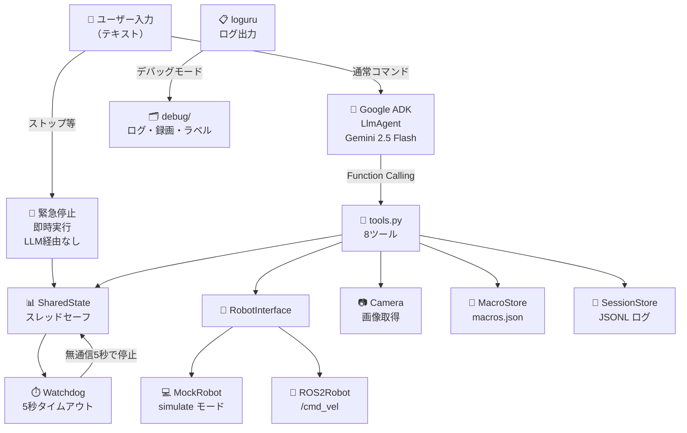

---

## データフロー

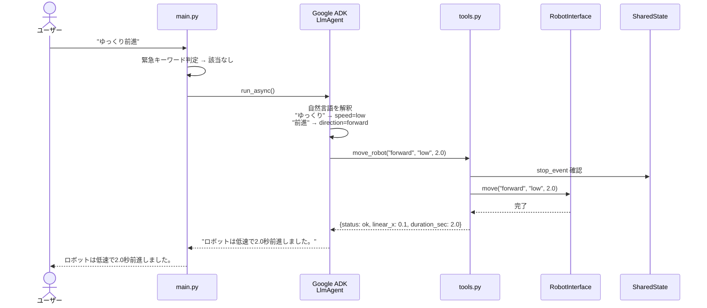

---

## 安全設計

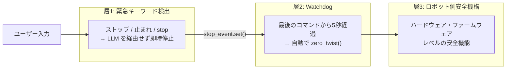

---

## ツール一覧

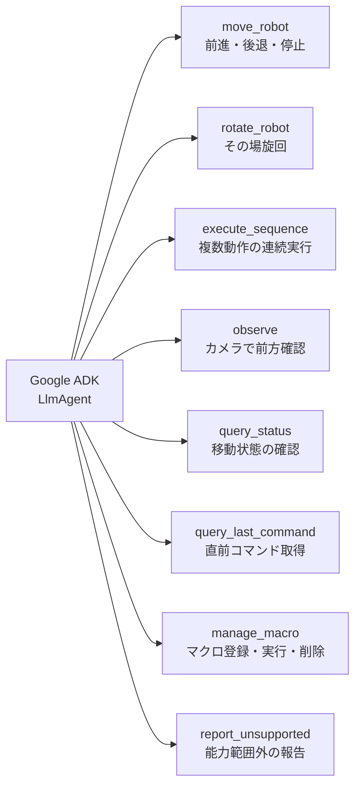

---

## 速度マッピング

| レベル | キーワード例 | linear (m/s) | angular (rad/s) |
|---|---|---|---|
| `low` | ゆっくり、slowly | 0.1 | 0.3 |
| `medium` | （指定なし） | 0.3 | 0.8 |
| `high` | 速く、fast | 0.5 | 1.5 |

---

## LLM なしでツールを直接テスト

```bash
python3 -m susumu_agent.debug_tools move forward medium 2.0
python3 -m susumu_agent.debug_tools rotate 90 medium
python3 -m susumu_agent.debug_tools sequence square
python3 -m susumu_agent.debug_tools --real --cmd-vel-topic /turtle1/cmd_vel move forward medium 2.0
```

---

## シミュレーションモード（ROS2 不要）

ROS2 なしで動作確認できる。

```bash
python3 -m susumu_agent.main
```

---

## デバッグモード

`_debug.launch.py` を使うと以下が `debug/` フォルダに生成される:

| ファイル | 内容 |
|---|---|
| `{ts}_susumu_agent.log` | loguru ログ（通常ノード） |
| `{ts}_susumu_agent_demo.log` | loguru ログ（デモノード） |
| `{ts}_command_log.jsonl` | ツール呼び出し履歴 |
| `{ts}_demo_labels.jsonl` | 指示・応答のラベル情報（デモ時のみ） |
| `{ts}_turtlesim_raw.mp4` | turtlesim 元録画（デモ時のみ） |
| `{ts}_turtlesim.srt` | 字幕ファイル・日本語＋英語（デモ時のみ） |
| `{ts}_turtlesim.mp4` | 字幕付き動画（デモ時のみ） |
| `{ts}_turtlesim.gif` | アニメーション GIF・320px（デモ時のみ） |

```bash
# debug_dir を変更
ros2 launch susumu_agent turtlesim_demo_debug.launch.py debug_dir:=/tmp/mydbg
```

---

## モード切り替え

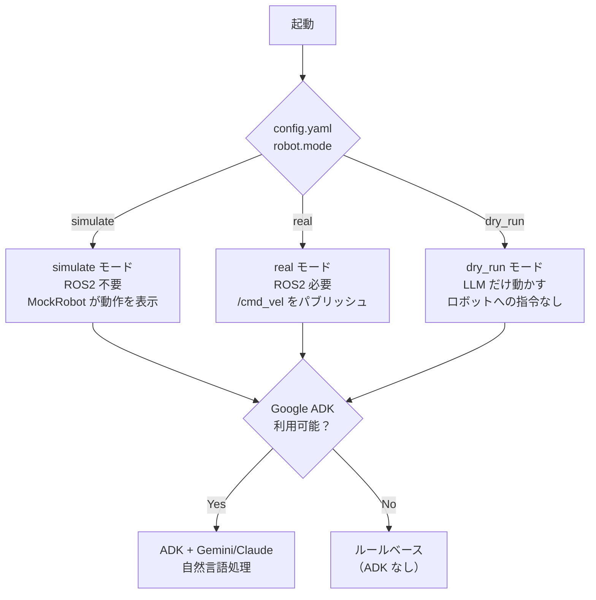

---

## 能力定義のカスタマイズ

`susumu_agent/capabilities.py` を編集するとロボットの能力定義を変更できる。変更後はシステムプロンプトに自動で反映される。

```python
# 速度の変更
SPEED_MAP = {
    "low":    {"linear": 0.05, "angular": 0.2},
    "medium": {"linear": 0.2,  "angular": 0.6},
    "high":   {"linear": 0.4,  "angular": 1.2},
}

# 緊急停止キーワードの追加
EMERGENCY_KEYWORDS = {
    "ストップ", "止まれ", "stop",
    "危ない",   # 追加例
}
```

---

## 1. システム概要

自然言語（日本語）でロボットを制御するシステム。
Google ADK（v2.1.0）をエージェントフレームワークとして使用し、
LLMバックエンドに Claude on Vertex AI を採用する。

---

## 2. 全体アーキテクチャ

```mermaid
flowchart TD
    A[音声入力\n任意・自前実装] -->|テキスト| B
    T[テキスト入力\nCLI / UI] --> B

    B[main.py\n入力ループ]

    B -->|緊急停止キーワード\nストップ/止まれ| SE[STOP_EVENT.set\n即時発火]
    B -->|通常コマンド| C

    subgraph ADK_AGENT["Google ADK エージェント層"]
        C[LlmAgent\nrobot_controller]
        C -->|tool call| D1[move_robot]
        C -->|tool call| D2[rotate_robot]
        C -->|tool call| D3[execute_sequence]
        C -->|tool call| D4[observe]
        C -->|tool call| D5[report_unsupported]
    end

    subgraph LLM_BACKEND["LLMバックエンド（Vertex AI）"]
        E[Claude on Vertex AI]
    end

    C <-->|API| E

    D1 & D2 & D3 -->|CURRENT_TWIST 更新| RS

    subgraph ROS2_THREAD["ROS2スレッド（独立）"]
        RS[SharedTwist\nCURRENT_TWIST]
        RS --> F[20Hz Timer\n/cmd_vel Publisher]
        SE -->|即時ゼロ送信| F
    end

    subgraph WATCHDOG["Watchdogスレッド"]
        W[最終コマンド時刻監視\n5秒無通信→自動停止]
        W -->|Twist 全0| F
    end

    D4 -->|画像取得| G[camera.py\nImage Subscriber]
    G -->|base64+鮮度チェック| D4
    D4 -->|tool_result\n画像データ| C
    C -->|マルチモーダル| E

    F -->|geometry_msgs/Twist| H[/cmd_vel トピック]
    H --> I[ロボット本体\n既存の安全機構付き]

    C -->|response text| K[テキスト出力 / 音声合成]
```

---

## 3. コンポーネント一覧

| コンポーネント | ファイル | 責務 |
|---|---|---|
| エントリポイント | `main.py` | 入力ループ・緊急停止検出・Runner起動 |
| ADKエージェント | `agent.py` | LlmAgent定義・ツール実装 |
| ROS2ブリッジ | `ros2_bridge.py` | rclpy ノード・20Hz Timer・SharedTwist |
| Watchdog | `watchdog.py` | 無通信タイムアウト監視・自動停止 |
| カメラ取得 | `camera.py` | Image Subscriber・base64変換・鮮度チェック |
| 能力・定数定義 | `capabilities.py` | 速度定数・システムプロンプト自動生成 |
| 依存定義 | `requirements.txt` | pip インストール可能なパッケージのみ |

---

## 4. ロボット能力定義（ホワイトリスト）

### 4.1 基本移動（⚡ direction/speed 列挙型に変更）

| direction | 日本語例 | speed=low | speed=medium | speed=high |
|---|---|---|---|---|
| `forward` | 前に移動、前進 | 0.1 m/s | 0.3 m/s | 0.5 m/s |
| `backward` | 後退、バック | -0.1 m/s | -0.3 m/s | -0.5 m/s |
| `stop` | ストップ、止まれ | 0.0 m/s | — | — |

### 4.2 速度マッピング（⚡ capabilities.py が単一定義源）

| speed 値 | 日本語表現 | linear (m/s) | angular (rad/s) |
|---|---|---|---|
| `low` | ゆっくり / ゆったり / ちょっとずつ | 0.1 | 0.3 |
| `medium` | 指定なし（デフォルト） | 0.3 | 0.8 |
| `high` | 素早く / 速く / ダッシュ | 0.5 | 1.5 |

### 4.3 旋回（⚡ duration はコード側で計算）

| angle_deg | 日本語例 | duration 計算式 |
|---|---|---|
| -90 | 右向いて | `90 / deg(angular_vel)` |
| +90 | 左向いて | `90 / deg(angular_vel)` |
| ±180 | 向きを変えて | `180 / deg(angular_vel)` |
| 任意 | N度回転して | `abs(angle_deg) / deg(angular_vel)` |

### 4.4 シーケンス

| 日本語例 | 内容 |
|---|---|
| 三角形を描くように移動 | forward(2s) → rotate(-120°) を3回 |
| 四角形を描くように移動 | forward(2s) → rotate(-90°) を4回 |
| N秒前進してM度回転 | Claude が MoveStep/RotateStep を生成 |

### 4.5 観察

| 日本語例 | 内容 |
|---|---|
| 何が見える？ | カメラ画像を tool_result でClaudeに渡し解析 |
| 前方に障害物はある？ | 同上 |

### 4.6 対応しないコマンド

| ユーザー入力 | 理由 |
|---|---|
| テーブルのコップを取って | マニピュレーター未定義 |
| 充電ステーションに戻って | 自律ナビゲーション未定義 |
| 音を出して | 音声出力未定義 |
| 地図を作って | SLAM未定義 |
| ジャンプして | 物理的に不可能 |

---

## 5. ADKエージェント設計

### 5.1 モデル設定

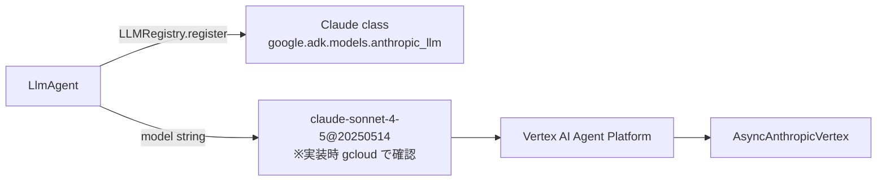

| 項目 | 値 |
|---|---|
| パッケージ | `google-adk>=2.1.0` |
| Claude接続方式 | Vertex AI (Agent Platform) |
| モデルクラス | `google.adk.models.anthropic_llm.Claude` |
| モデル文字列 | `claude-sonnet-4-5@20250514`（⚡ 実装時に `gcloud ai models list` で確認） |
| レジストリ登録 | `LLMRegistry.register(Claude)` が必要 |
| 認証 | Application Default Credentials (ADC) |

### 5.2 必要な環境変数（.env ファイルで管理）

プロジェクトルートの `.env` に記載する（`.env.sample` 参照）:

```dotenv
GOOGLE_CLOUD_PROJECT=your-project-id
```

`agent.py` が `load_dotenv()` で読み込み、`GOOGLE_GENAI_USE_VERTEXAI=TRUE` は自動設定される。  
モデルやリージョンなどその他の設定は `config.yaml` で管理する。`.env` は `.gitignore` で除外。

### 5.3 ツール定義（⚡ 型安全化・rotate_robot 分離）

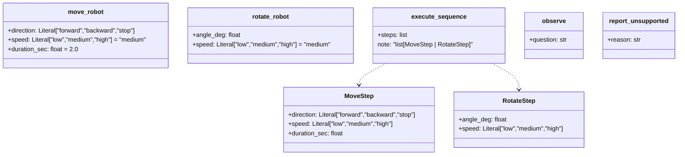

| ツール名 | シグネチャ | 変更点 |
|---|---|---|
| `move_robot` | `(direction, speed, duration_sec)` | ⚡ float→列挙型、async |
| `rotate_robot` | `(angle_deg, speed)` | ⚡ 新規分離、async |
| `execute_sequence` | `(steps: list[MoveStep\|RotateStep])` | ⚡ dict→TypedDict、進捗追跡 |
| `observe` | `(question: str)` | ⚡ 取得のみ・解析はClaudeに委譲 |
| `query_status` | `()` | ⚡ 新規（現在の移動状態を返す） |
| `report_unsupported` | `(reason: str)` | 変更なし |

---

## 6. コマンド解釈フロー

### 6.1 通常コマンド

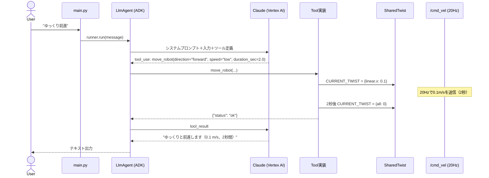

### 6.2 緊急停止（⚡ 新規）

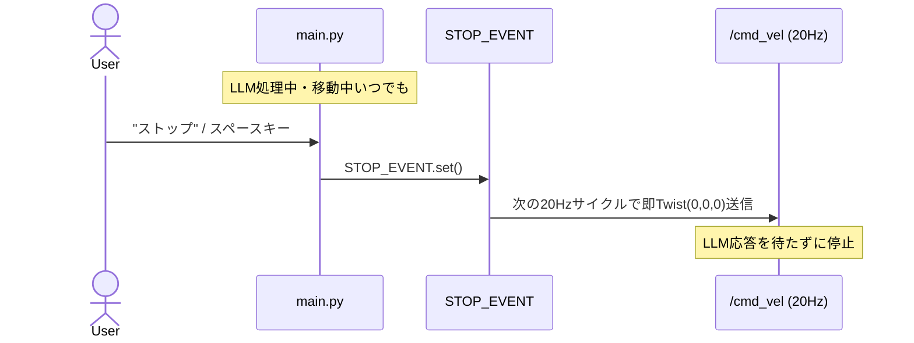

### 6.3 observe フロー（⚡ LLM二重呼び出しを解消）

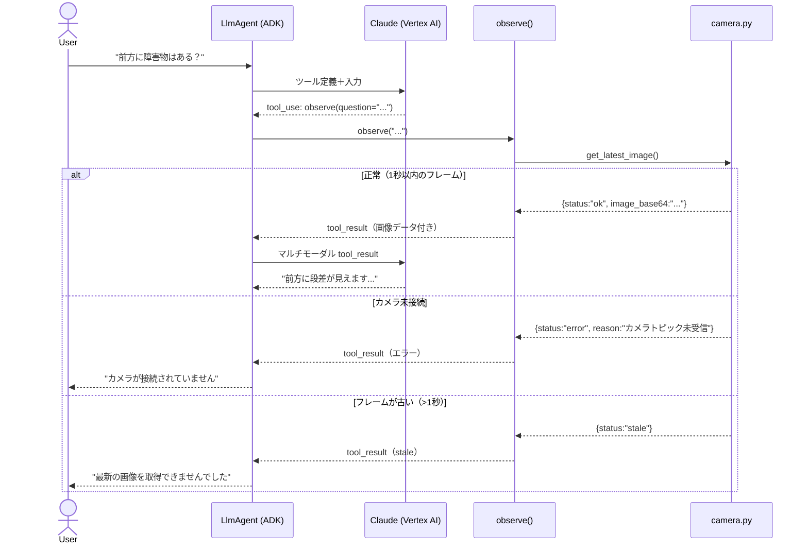

### 6.4 未対応コマンド

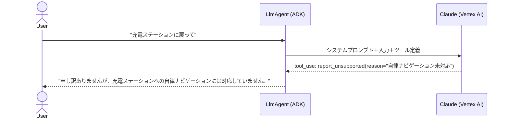

---

## 7. 安全設計（⚡ 全て新規）

```mermaid
flowchart TD
    subgraph SAFETY["安全レイヤー（3重）"]
        S1["① 緊急停止キーワード検出\nmain.py でLLMを経由せず即時停止"]
        S2["② Watchdog\n5秒無通信→自動停止"]
        S3["③ 既存の安全機構\n/cmd_vel 下流の外部安全装置"]
    end

    S1 --> SE[STOP_EVENT]
    S2 --> SE
    SE --> ROS[/cmd_vel Twist(0,0,0)]
    ROS --> S3
```

| レイヤー | 仕組み | 発動条件 |
|---|---|---|
| ① 緊急停止 | `STOP_EVENT` (threading.Event) | 「ストップ」「止まれ」/ スペースキー |
| ② Watchdog | 最終コマンド時刻監視 | 5秒間コマンドなし |
| ③ 外部安全機構 | 既存の仕組み | 障害物・転倒等 |

**スレッドモデル：**

| スレッド | 役割 |
|---|---|
| メインスレッド | 入力ループ・緊急停止検出・ADK Runner |
| ROS2スレッド | `rclpy.spin()` + 20Hz Timer |
| Watchdogスレッド | 無通信タイムアウト監視 |

---

## 8. システムプロンプト設計（⚡ capabilities.py から自動生成）

`capabilities.py` の `build_system_prompt()` が唯一の定義源。
手動でプロンプトと定数を二重管理しない。

```python
# capabilities.py
SPEED_MAP = {
    "low":    {"linear": 0.1, "angular": 0.3},
    "medium": {"linear": 0.3, "angular": 0.8},
    "high":   {"linear": 0.5, "angular": 1.5},
}

SPEED_WORDS = {
    "low":    ["ゆっくり", "ゆったり", "ちょっとずつ"],
    "medium": [],  # デフォルト
    "high":   ["素早く", "速く", "ダッシュ"],
}

ANGULAR_VEL_DEFAULT = 0.8  # rad/s（rotate_robot の duration 計算に使用）

def build_system_prompt() -> str:
    # capabilities 定義からプロンプトを自動生成
    ...
```

プロンプト中のルール（固定部分）：
1. 能力範囲内 → `move_robot` / `rotate_robot` / `execute_sequence` を呼ぶ
2. 能力範囲外 → 必ず `report_unsupported` を呼ぶ（代替動作禁止）
3. 時間指定なし → `duration_sec=2.0`
4. 返答は日本語・実行内容（速度・時間）を含める

---

## 9. ファイル構成

```
susumu_agent/
├── config.yaml               # 全設定（トピック名・モデル・モード等）
├── .env                      # 認証情報（gitignore 対象）
├── .env.sample               # .env テンプレート
├── debug/                    # デバッグ出力先（gitignore 対象）
├── requirements.txt          # pip インストール可能パッケージ
├── launch/
│   ├── mock.launch.py
│   ├── mock_debug.launch.py
│   ├── real.launch.py
│   ├── real_debug.launch.py
│   ├── turtlesim.launch.py
│   ├── turtlesim_debug.launch.py
│   ├── turtlesim_demo.launch.py
│   └── turtlesim_demo_debug.launch.py
└── susumu_agent/
    ├── main.py               # 入力ループ・緊急停止・フィードバック表示
    ├── agent.py              # LlmAgent 定義
    ├── tools.py              # 8ツール実装
    ├── capabilities.py       # 速度定数・プロンプト自動生成
    ├── shared_state.py       # SharedState 集約
    ├── watchdog.py           # 無通信タイムアウト監視
    ├── camera.py             # 画像取得
    ├── session_store.py      # セッション・コマンド履歴 JSONL
    ├── macro_store.py        # マクロ登録・読み込み
    ├── demo_node.py          # turtlesim 自動デモノード
    ├── debug_tools.py        # LLM なしツール直接テスト CLI
    ├── ros_logger.py         # loguru → ROS2 ロガーブリッジ
    ├── turtlesim_recorder.py # turtlesim 画面録画（ffmpeg x11grab）
    └── robot/
        ├── interface.py      # RobotInterface 抽象クラス
        ├── ros2_robot.py     # ROS2 実装
        └── mock_robot.py     # simulate モード用
```

---

## 10. 依存パッケージ（⚡ uv + pyproject.toml 管理）

**pyproject.toml（uv sync でインストール）：**

| パッケージ | バージョン | 用途 |
|---|---|---|
| `google-adk` | `>=2.1.0,<3.0.0` | ADK本体 |
| `anthropic[vertex]` | `>=0.50.0,<1.0.0` | Claude on Vertex AI |
| `google-cloud-aiplatform` | `>=1.90.0,<2.0.0` | Vertex AI認証 |
| `opencv-python` | `>=4.9.0,<5.0.0` | カメラ画像処理 |
| `pyyaml` | `>=6.0,<7.0` | 設定ファイル読み込み |
| `loguru` | `>=0.7.0,<1.0.0` | ログ出力 |
| `python-dotenv` | `>=1.0.0,<2.0.0` | .env 読み込み |

```bash
~/.local/bin/uv sync
```

**ROS2 環境前提（pip 不可・ROS2 インストールに含まれる）：**

| パッケージ | 取得方法 |
|---|---|
| `rclpy` | ROS2 インストール済み環境 |
| `geometry_msgs` | ROS2 インストール済み環境 |
| `sensor_msgs` | ROS2 インストール済み環境（observe用） |

---

## 11. テスト戦略（⚡ 新規）

```mermaid
flowchart LR
    A[単体テスト\nROS2不要] --> B[統合テスト\nROS2 mock] --> C[実機テスト]

    subgraph A_detail["単体テスト（pytest）"]
        A1[speed→velocity マッピング]
        A2[rotate_robot duration 計算]
        A3[build_system_prompt 生成]
        A4[LLMツール呼び出し\nモック使用]
    end

    subgraph B_detail["統合テスト（ROS2 mock）"]
        B1[/cmd_vel トピック値の検証]
        B2[STOP_EVENT 緊急停止確認]
        B3[Watchdog タイムアウト確認]
        B4[カメラ未接続エラー応答]
    end
```

| テスト種別 | ツール | ROS2 必要 |
|---|---|---|
| 単体テスト | pytest | 不要 |
| 統合テスト | pytest + rclpy mock | 要 |
| 実機テスト | 手動 / ログ確認 | 要 |

---

## 12. セキュリティ・入力検証（⚡ 2周目追加）

### 12.1 入力バリデーション

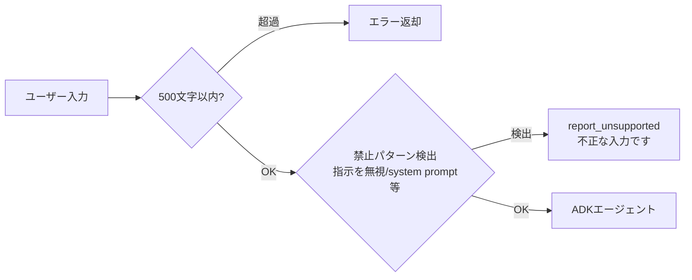

### 12.2 ツールパラメータ境界値

| パラメータ | 型 | 許容範囲 | 超過時 |
|---|---|---|---|
| `speed` | `Literal` | low/medium/high のみ | ADK スキーマ違反で拒否 |
| `direction` | `Literal` | forward/backward/stop のみ | ADK スキーマ違反で拒否 |
| `duration_sec` | `float` | 0.1〜30.0 秒 | clamp（上限30秒） |
| `angle_deg` | `float` | -360〜+360 度 | clamp |

---

## 13. スレッド安全性（⚡ 2周目追加）

### 13.1 共有状態の保護

| 共有変数 | 保護方法 |
|---|---|
| `CURRENT_TWIST` | `threading.Lock` で read/write を保護 |
| `last_command_time` | `threading.Lock` で保護 |
| `STOP_EVENT` | `threading.Event`（スレッドセーフ） |
| `SHUTDOWN_EVENT` | `threading.Event`（スレッドセーフ） |

### 13.2 STOP_EVENT のライフサイクル

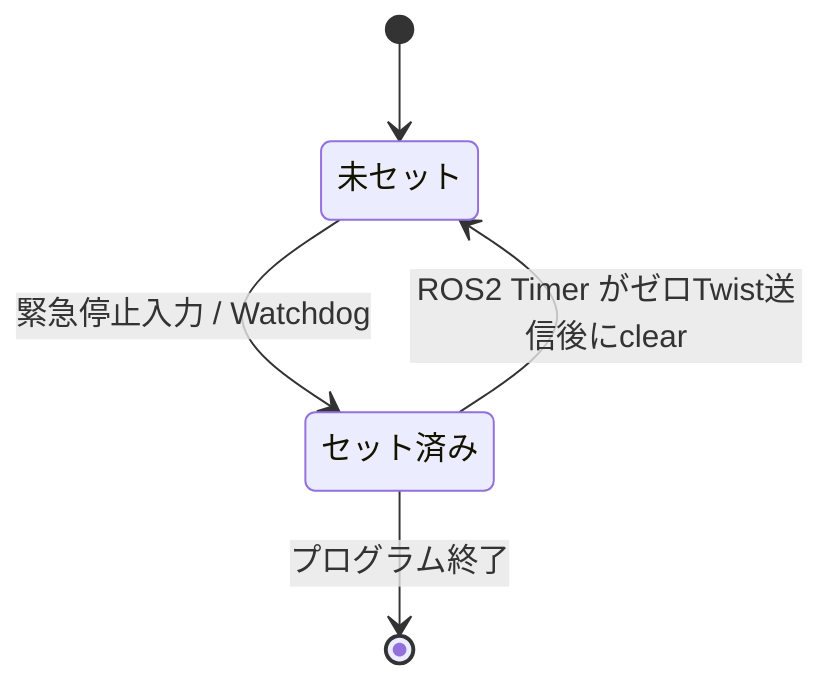

### 13.3 execute_sequence の割り込み

```python
for step in steps:
    if STOP_EVENT.is_set():   # 各ステップ開始前にチェック
        break
    execute_step(step)
```

### 13.4 スレッド終了順序

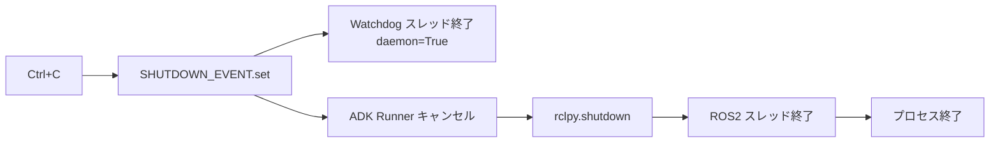

---

## 14. ユーザー体験設計（⚡ 2周目追加）

### 14.1 実行中フィードバック

| タイミング | 表示内容 |
|---|---|
| コマンド受信直後 | 「考え中...」 |
| tool 実行開始時 | 「前進中（0.1 m/s）...」 |
| tool 完了時 | 「前進しました（2秒間）」 |
| エラー時 | 「エラー：{日本語説明}」 |

### 14.2 曖昧指示への対応

| 入力パターン | 解釈 |
|---|---|
| 「もうちょっと」「少し」 | speed="low", duration_sec=1.0 |
| 「さっきより速く」 | 直前コマンドの speed を1段階上げる |
| 「もっと長く」 | 直前 duration_sec を2倍 |
| 解釈不能な相対指示 | 「どのくらいですか？」と確認 |

### 14.3 追加ツール

| ツール | 役割 |
|---|---|
| `query_status()` | CURRENT_TWIST を読み「移動中/停止中」を返す |

### 14.4 長時間シーケンス確認

推定実行時間が10秒を超えるシーケンスは、実行前に「約X秒かかります。実行しますか？」と確認する（システムプロンプトに明記）。

---

## 15. 拡張性・設定外部化（⚡ 2周目追加）

### 15.1 config.yaml

```yaml
robot:
  cmd_vel_topic: "/cmd_vel"
  image_topic: "/camera/image_raw"
  watchdog_timeout_sec: 5.0
  max_duration_sec: 30.0
  max_angle_deg: 360.0

llm:
  model: "claude-sonnet-4-5@20250514"
  project: "your-project-id"
  location: "asia-northeast1"
```

### 15.2 変更時の影響局所化

| 変更種別 | 変更箇所 |
|---|---|
| モデル文字列更新 | `config.yaml` 1行のみ |
| ROS2 トピック変更 | `config.yaml` 1行のみ |
| 速度パラメータ調整 | `capabilities.py` の SPEED_MAP のみ |
| ADK API 変更 | `agent.py` の LlmAgent 定義のみ |

### 15.3 ファイル構成（更新後）

```
susumu_agent/
├── config.yaml               # ⚡ 全設定を外部化
├── main.py                   # 入力ループ・緊急停止・フィードバック表示
├── agent.py                  # LlmAgent・6ツール（query_status 追加）
├── ros2_bridge.py            # SharedTwist・Lock・20Hz Timer
├── watchdog.py               # 無通信タイムアウト監視
├── camera.py                 # Image Subscriber・鮮度チェック
├── capabilities.py           # 速度定数・バリデーション・プロンプト自動生成
├── requirements.txt          # pip 可能パッケージのみ
├── requirements-dev.txt      # pytest・mock
└── voice/
    ├── recognizer.py
    └── synthesizer.py
```

---

## 17. コスト・レイテンシ設計（⚡ 3周目追加）

### 17.1 トークン節約

| 対策 | 方法 |
|---|---|
| システムプロンプト圧縮 | 速度表の日本語例を省略・最小化 |
| セッション履歴上限 | 直近5ターンのみ保持（ADK SessionConfig） |
| observe 画像縮小 | 送信前に 640×480 へリサイズ（OpenCV） |

### 17.2 応答時間目標

| 処理 | 目標 | 超過時 |
|---|---|---|
| LLM 応答（単純コマンド） | 3秒以内 | 再試行1回 → エラー → 停止 |
| LLM 応答（observe） | 5秒以内 | エラー通知 |
| cmd_vel 遅延 | 50ms 以内 | Watchdog が別スレッドなので影響なし |

---

## 18. 障害・リカバリ設計（⚡ 3周目追加）

### 18.1 起動チェック

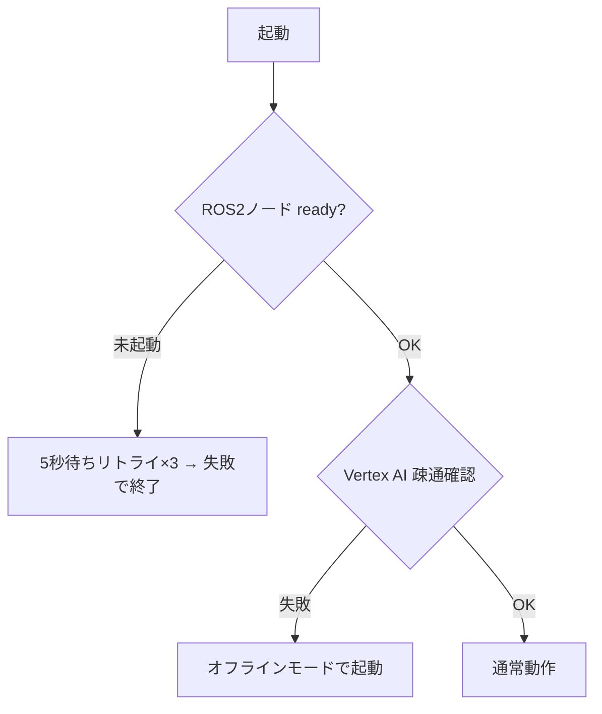

### 18.2 障害別の対応

| 障害 | 対応 |
|---|---|
| Vertex AI タイムアウト | 再試行1回 → エラー通知 → ロボット停止 |
| Vertex AI 完全障害 | オフラインモード（キーワードマッチ） |
| ROS2 ノード未起動 | 起動失敗で終了 |
| ネットワーク切断 | STOP_EVENT → Watchdog が停止 |
| カメラ切断 | observe のみ失敗、移動は継続 |

### 18.3 オフラインモード（Vertex AI 障害時）

LLM を経由せずキーワードマッチングで固定コマンドのみ受け付ける。

| キーワード | 動作 |
|---|---|
| ストップ / 止まれ | 停止 |
| 前進 | medium forward 2秒 |
| 後退 | medium backward 2秒 |

---

## 19. ログ・デバッグ設計（⚡ 3周目追加）

### 19.1 ログレベル定義

| レベル | 記録内容 |
|---|---|
| `INFO` | ユーザー入力・ツール名・応答テキスト・cmd_vel 値 |
| `DEBUG` | LLM 生レスポンス・パラメータ詳細・レイテンシ |
| `WARNING` | clamp 発動・stale カメラ・再試行 |
| `ERROR` | API エラー・ROS2 エラー・タイムアウト |

### 19.2 構造化ログ形式

```json
{"ts": "2026-06-05T12:34:56", "level": "INFO",  "event": "tool_call",   "tool": "move_robot", "params": {"direction": "forward", "speed": "low", "duration_sec": 2.0}}
{"ts": "2026-06-05T12:34:58", "level": "INFO",  "event": "cmd_vel",     "linear_x": 0.1, "angular_z": 0.0}
{"ts": "2026-06-05T12:35:00", "level": "INFO",  "event": "tool_result", "status": "ok", "latency_ms": 1823}
{"ts": "2026-06-05T12:35:01", "level": "WARN",  "event": "clamp",       "param": "duration_sec", "original": 99.0, "clamped": 30.0}
```

### 19.3 ログファイル

| ファイル | 内容 | ローテーション |
|---|---|---|
| `robot_nl.log` | INFO 以上 | 10MB × 5世代 |
| `robot_nl_debug.log` | DEBUG 以上（任意） | 50MB × 3世代 |

---

## 20. データ永続化・状態管理（⚡ 4周目追加）

| データ種別 | 保存方法 | 保存期間 |
|---|---|---|
| セッション履歴（直近5ターン） | `session_history.jsonl` | 24時間 |
| コマンド実行履歴 | `debug/{ts}_command_log.jsonl`（デバッグモード時のみ） | セッション単位 |
| CURRENT_TWIST | メモリのみ（揮発） | プロセス生存中 |
| 推定位置 | メモリのみ（参考値） | プロセス生存中 |

再起動時は `CURRENT_TWIST=0`・`STOP_EVENT=clear` で安全側に初期化。

---

## 21. マルチロボット対応（⚡ 5周目追加）

現設計は **1ユーザー × 1ロボット** を対象とする。  
将来拡張に備え、トピック名を名前空間化する最小変更のみ実施。

```yaml
# config.yaml
robot:
  namespace: ""   # 空=デフォルト。複数台時は "/robot_a" 等を設定
```

トピック名は `f"{namespace}/cmd_vel"` で解決。

---

## 22. 自然言語品質（⚡ 6周目追加）

### 22.1 速度キーワード拡充

| speed | キーワード（追加分含む） |
|---|---|
| `low` | ゆっくり / ゆったり / ちょっとずつ / ちょい / そろそろ / のんびり / 少し |
| `medium` | 普通に / 普通 / 通常 / 指定なし |
| `high` | 素早く / 速く / ダッシュ / 全力 / 急いで / 全速力 |

### 22.2 距離指定の変換

| 指示例 | 変換 |
|---|---|
| 「50cm前進」 | `duration = 0.5 / speed_linear` 秒 |
| 「1メートル動いて」 | `duration = 1.0 / speed_linear` 秒 |
| 「3歩分進んで」 | 1歩=0.5m として計算 |

### 22.3 言語の包容性

日本語・英語・ローマ字・口語・敬語・命令形すべてを受け付ける（システムプロンプトに明記）。  
条件付き指示（「〜なければ〜して」）は `report_unsupported` を呼ぶ。

---

## 23. リソース消費最適化（⚡ 7周目追加）

### 23.1 cmd_vel 送信頻度

| 状態 | 頻度 | 理由 |
|---|---|---|
| IDLE（停止中） | 1Hz | 安全機構への生存確認 |
| ACTIVE（移動中） | 20Hz | ROS2 標準 |

### 23.2 camera.py 遅延起動

- デフォルト: 購読無効
- `observe` 初回呼び出し時: 動的に購読開始
- 60秒未使用: 購読停止

### 23.3 Watchdog の省 CPU 実装

```python
shutdown_event.wait(timeout=1.0)  # sleep ループより効率的
```

---

## 24. テスト自動化・CI（⚡ 8周目追加）

### 24.1 テストレイヤー

| レイヤー | 環境 | テスト内容 |
|---|---|---|
| Layer 1 | Python のみ | 速度マッピング・duration 計算・clamp・バリデーション |
| Layer 2 | Python + LLM モック | ツール呼び出し名・report_unsupported 判定 |
| Layer 3 | 実 Vertex AI（週1） | 20種の代表的な指示でゴールデンテスト |

### 24.2 必須テストケース

| テスト | 確認内容 |
|---|---|
| 速度マッピング | low=0.1 / medium=0.3 / high=0.5 |
| 旋回計算 | 90°・180°・360° の duration 精度 |
| clamp | duration=99→30.0 / angle=720→360.0 |
| 緊急停止 | STOP_EVENT 後に Twist(0,0,0) 送信 |
| Watchdog | 5秒無通信で自動停止 |
| 未対応判定 | `report_unsupported` 呼び出し確認 |

---

## 25. デプロイ・起動管理（⚡ 9周目追加）

```bash
# 起動（1コマンド）
ros2 launch robot_nl_controller turtlesim_demo.launch.py
```

systemd サービス化により電源 ON で自動起動・クラッシュ時自動再起動。  
GCP 資格情報は `/etc/robot_nl/secrets.env`（`chmod 600`）で管理。

---

## 26. プライバシー・倫理（⚡ 10周目追加）

### 26.1 カメラ画像の取り扱い

- 送信前に顔検出＋ブラー処理（OpenCV）
- `config.yaml` の `camera.send_to_cloud: true/false` で制御
- `false` の場合はカメラ機能を無効化

### 26.2 ログの個人情報最小化

- ユーザー入力テキストは DEBUG レベルのみ（INFO に残さない）
- 画像 base64 はログに残さない
- セッション履歴の保存期間は24時間

### 26.3 倫理ガードレイン（システムプロンプト最優先）

```
## 【最優先】安全・倫理ルール
1. 人物・動物への突進・追跡指示 → 必ず report_unsupported
2. 「壊して」「ぶつけて」「攻撃して」等の破壊的指示 → 拒否
3. 緊急停止を無効化する指示 → 拒否
（以降の能力チェックより上位。絶対に破らない）
```

---

## 27. ADK 固有の設計（⚡ 11周目追加）

### 27.1 非同期ツール

全ツールを `async def` で実装。`duration` の待機は `asyncio.sleep` を使用（イベントループをブロックしない）。

### 27.2 Runner の非同期呼び出し

`runner.run_async()` または `runner.run_live()` を使用し、`tool_call` イベントをストリーミングでフィードバック表示。

### 27.3 LLMRegistry の登録タイミング

```python
# agent.py の先頭（モジュールロード時・関数外）
LLMRegistry.register(Claude)
```

### 27.4 execute_sequence の進捗追跡

各ステップ前に `STOP_EVENT` チェック。戻り値に `completed_steps` を含め、中断箇所を明示。

---

## 28. ユーザーオンボーディング（⚡ 12周目追加）

### 28.1 起動時ウェルカムメッセージ

```
ロボット制御システム起動しました。
できること: 前進・後退・停止・旋回・シーケンス移動・カメラ確認
例: 「ゆっくり前進」「右向いて」「三角形を描いて」「何が見える？」
緊急停止: スペースキー または「ストップ」
```

### 28.2 `help` コマンド

「ヘルプ」「何ができる？」でLLMを経由せず即座に能力一覧を返す。

---

## 29. システムプロンプト優先順位（⚡ 13周目・最終整合）

```
1. 安全・倫理ルール（最優先・絶対）
2. できること（能力ホワイトリスト）
3. できないこと
4. 解釈ルール（速度・時間・距離・言語）
5. 返答フォーマット
```

---

## 30. 最終ファイル構成（⚡ 全周統合）

```
susumu_agent/
├── config.yaml               # 全設定（トピック名・モデル・閾値）
├── main.py                   # 入力ループ・緊急停止・フィードバック表示
├── agent.py                  # LlmAgent・6ツール（async）
├── ros2_bridge.py            # SharedTwist・Lock・IDLE/ACTIVE Timer
├── watchdog.py               # 無通信タイムアウト監視
├── camera.py                 # Image Subscriber・遅延起動・鮮度チェック
├── capabilities.py           # 速度定数・バリデーション・プロンプト自動生成
├── session_store.py          # セッション履歴 JSONL 読み書き
├── requirements.txt          # pip 可能パッケージのみ
├── requirements-dev.txt      # pytest・mock
├── launch/
│   └── turtlesim_demo.launch.py    # ROS2 launch ファイル
├── deploy/
│   ├── robot-nl.service      # systemd unit
│   └── secrets.env.example   # シークレットテンプレート
└── voice/
    ├── recognizer.py          # 音声→テキスト 抽象基底クラス
    └── synthesizer.py         # テキスト→音声 抽象基底クラス
```

---

## 32. ROS2 QoS 設定（⚡ 14周目追加）

```python
from rclpy.qos import QoSProfile, ReliabilityPolicy, DurabilityPolicy, HistoryPolicy
qos = QoSProfile(
    reliability=ReliabilityPolicy.BEST_EFFORT,
    durability=DurabilityPolicy.VOLATILE,
    history=HistoryPolicy.KEEP_LAST,
    depth=1
)
```

> 安全機構側のサブスクライバーとの QoS 互換性を実装時に確認すること。

---

## 33. コンテキスト記憶（⚡ 15周目追加）

**直前コマンド記憶と参照パターン：**

| 入力 | 解釈 |
|---|---|
| 「さっきと同じ動きを」 | `query_last_command()` で再実行 |
| 「逆方向に戻って」 | 直前 direction を反転 |
| 「同じ速さでもっと長く」 | 直前 speed 保持、duration_sec を2倍 |

**ツール追加（7本目）：** `query_last_command()` — 直前のツール呼び出し内容を返す。

---

## 34. 速度制御の物理的配慮（⚡ 16周目追加）

- **減速ランプ**（`config.yaml` の `ramp_down_enabled: true`）: 停止時に5ステップで段階的に速度を下げる（衝撃軽減）
- **旋回精度の注記**: 角速度×時間の理論値。スリップ・摩擦による誤差あり。精度が必要な場合はエンコーダーフィードバックを別途実装

---

## 35. 音声I/F設計（⚡ 17周目追加）

- 音声認識レイヤーで緊急停止キーワード（ストップ/止まれ/やめて等）を検出し、LLM を経由せず即時 `STOP_EVENT.set()`
- 音声出力は `verbosity: brief` に自動切り替え（「前進します」程度の短文）
- 音声合成発話中でも緊急停止キーワードで発話を中断

---

## 36. ネットワーク・障害設計補足（⚡ 18周目追加）

**タイムアウト設定（config.yaml）：**

```yaml
llm:
  timeout_sec: 5           # 標準
  timeout_observe_sec: 10  # observe（画像含む）
  retry_max: 1             # タイムアウト時の再試行回数
  backoff_base_sec: 1.0    # 指数バックオフの基底

robot:
  offline_fallback: true   # Vertex AI 完全障害時にオフラインモードへ
  backend: "vertex_ai"     # vertex_ai / local_llm（将来対応）
```

---

## 37. モデル更新フロー（⚡ 19周目追加）

1. 新モデル文字列を `config-staging.yaml` に設定
2. Layer3 ゴールデンテスト（`tests/golden/run_golden.py`）を実行
3. 全件パスで `config.yaml` に反映。失敗時はプロンプト調整またはロールバック

モデルは `config.yaml` の `llm.model` のみで管理する。

---

## 38. アクセス制御（⚡ 20周目追加）

```yaml
# config.yaml
auth:
  mode: "none"        # none / single_token / multi_user
  token: ""           # single_token モード用
```

- 排他制御：`asyncio.Lock()` で同時操作を1オペレーターに制限
- 操作ログ：`operator` フィールドを全ログに追加

---

## 39. モニタリング（⚡ 21周目追加）

**Prometheus メトリクス（`/metrics` エンドポイント）：**

| メトリクス | 内容 |
|---|---|
| `robot_commands_total{tool}` | ツール別実行回数 |
| `robot_unsupported_total` | 未対応コマンド回数 |
| `robot_api_latency_seconds` | LLM 応答レイテンシ |
| `robot_emergency_stops_total` | 緊急停止回数 |
| `robot_twist_linear_x` | 現在速度（Gauge） |

**アラート：** 緊急停止が5分で3回以上 → 緊急通知。

---

## 40. マクロ機能（⚡ 22周目追加）

- 「この動きをXとして登録して」で直前シーケンスを `macros.json` に保存
- 「Xして」で登録済みマクロを呼び出し
- **ツール追加（8本目）：** `manage_macro(action, name, steps)`

---

## 41. センサー拡張性（⚡ 23周目追加）

- `observe(sensor="camera"|"lidar"|"ultrasonic")` で将来的なセンサー拡張に対応
- `SensorBase` 抽象クラスを定義し、`CameraSensor` / `LidarSensor` として実装分離

---

## 42. 多言語対応（⚡ 24周目追加）

```yaml
interface:
  language: "auto"   # ja / en / auto（入力言語を自動検出）
```

英語キーワード: slowly→low / fast→high / etc. Claude の多言語理解に委譲。

---

## 43. エッジケース処理（⚡ 25周目追加）

| 入力 | 処理 |
|---|---|
| 空文字・スペースのみ | 無視 |
| 500文字超 | 先頭500文字に切り詰め＋警告 |
| 処理中の連続入力 | コマンドキュー（最大3件）で管理 |

---

## 44. 依存関係管理（⚡ 26周目追加）

- `requirements.txt` はメジャーバージョン上限付き（例: `google-adk>=2.1.0,<3.0.0`）
- `requirements.lock` で再現可能ビルドを保証
- 週1回 `pip-audit` でセキュリティ脆弱性チェック

---

## 45. フィールド運用（⚡ 27周目追加）

- バッテリー残量トピック連携（オプション）: 20%で警告、10%で移動禁止
- スタック検知（オプション）: cmd_vel 送信中に `/odom` が変化しない場合、停止＋通知
- 法規制対応: `compliance_mode: true` で `human_presence_max_speed: 0.25 m/s` を適用（ISO/TS 15066 参考値）

---

## 46. コードアーキテクチャ（⚡ 28周目追加）

**`RobotInterface` で ROS2 への依存を逆転：**

```
robot/
├── interface.py    # 抽象クラス
├── ros2_robot.py   # 実機実装
└── mock_robot.py   # テスト・simulate モード用
```

**`SharedState` クラスで全共有変数を集約：**
```python
@dataclass
class SharedState:
    current_twist: Twist
    lock: threading.Lock
    stop_event: threading.Event
    shutdown_event: threading.Event
    last_command: dict | None
```

---

## 47. ユーザー習熟度対応（⚡ 29周目追加）

```yaml
interface:
  verbosity: "normal"   # brief / normal / verbose
```

初回起動検知（session_history.jsonl が存在しない場合）でチュートリアルをオファー。

---

## 48. コスト管理（⚡ 31周目追加）

```yaml
cost_control:
  daily_command_limit: 500
  daily_observe_limit: 50
  alert_threshold_usd: 10.0
```

上限到達時はオフラインモードに自動切り替え。

---

## 49. 動作モード（⚡ 32周目追加）

```yaml
robot:
  mode: "real"   # real / simulate / dry_run
```

| モード | 動作 |
|---|---|
| `real` | 実機に送信 |
| `simulate` | MockRobot で端末表示のみ |
| `dry_run` | LLM は呼ぶが cmd_vel 送信なし |

---

## 50. アクセシビリティ（⚡ 33周目追加）

```yaml
interface:
  feedback_modes: ["text", "audio", "visual"]
```

| 状態 | 色・テキスト |
|---|---|
| 待機 | 白 `[待機]` |
| 処理中 | 黄 `[考え中...]` |
| 移動中 | 緑 `[前進 →]` |
| 緊急停止 | 赤太字 `[停止!]` |

音声合成未実装時はテキスト出力にフォールバック。

---

## 51. 最終ファイル構成（⚡ 全周統合・最終版）

```
susumu_agent/
├── config.yaml               # 全設定（トピック・モデル・モード等）
├── pyproject.toml            # uv / colcon 共通パッケージ定義
├── .env                      # 認証情報（gitignore 対象）
├── .env.sample               # .env テンプレート
├── debug/                    # デバッグ出力先（gitignore 対象）
│   ├── {ts}_susumu_agent.log
│   ├── {ts}_command_log.jsonl
│   ├── {ts}_demo_labels.jsonl
│   ├── {ts}_turtlesim_raw.mp4
│   ├── {ts}_turtlesim.srt
│   ├── {ts}_turtlesim.mp4
│   └── {ts}_turtlesim.gif
├── launch/
│   ├── mock.launch.py
│   ├── mock_debug.launch.py
│   ├── real.launch.py
│   ├── real_debug.launch.py
│   ├── turtlesim.launch.py
│   ├── turtlesim_debug.launch.py
│   ├── turtlesim_demo.launch.py
│   └── turtlesim_demo_debug.launch.py
├── tests/
│   ├── unit/                 # ROS2 不要の単体テスト
│   ├── mock/                 # MockRobot 使用（未実装）
│   └── golden/               # 実 LLM・週1回（未実装）
└── susumu_agent/
    ├── main.py               # 入力ループ・緊急停止・フィードバック表示
    ├── agent.py              # LlmAgent 定義
    ├── tools.py              # 8ツール実装
    ├── capabilities.py       # 速度定数・プロンプト自動生成
    ├── shared_state.py       # SharedState 集約
    ├── watchdog.py           # 無通信タイムアウト監視
    ├── camera.py             # 画像取得
    ├── session_store.py      # セッション・コマンド履歴 JSONL
    ├── macro_store.py        # マクロ登録・読み込み
    ├── demo_node.py          # turtlesim 自動デモ（SRT・MP4・GIF 生成）
    ├── debug_tools.py        # LLM なしツール直接テスト CLI
    ├── ros_logger.py         # loguru → ROS2 ロガーブリッジ
    ├── turtlesim_recorder.py # turtlesim 画面録画（ffmpeg x11grab）
    └── robot/
        ├── interface.py      # RobotInterface 抽象クラス
        ├── ros2_robot.py     # ROS2 実装
        └── mock_robot.py     # simulate モード用
```

---

## 52. 最終ツール一覧（8ツール）

| # | ツール | シグネチャ | 役割 |
|---|---|---|---|
| 1 | `move_robot` | `(direction, speed, duration_sec)` | 直進・後退・停止 |
| 2 | `rotate_robot` | `(angle_deg, speed)` | 旋回（duration はコード計算） |
| 3 | `execute_sequence` | `(steps)` | 複数ステップ・進捗追跡 |
| 4 | `observe` | `(question, sensor)` | センサー取得（カメラ等） |
| 5 | `query_status` | `()` | 現在の移動状態 |
| 6 | `query_last_command` | `()` | 直前コマンド参照 |
| 7 | `manage_macro` | `(action, name, steps)` | マクロ登録・実行 |
| 8 | `report_unsupported` | `(reason)` | 未対応コマンド通知 |

---

## 53. config.yaml 全体像

```yaml
robot:
  namespace: ""
  cmd_vel_topic: "/cmd_vel"
  image_topic: "/camera/image_raw"
  battery_topic: ""             # 空の場合は無視
  battery_low_threshold: 20
  battery_critical_threshold: 10
  watchdog_timeout_sec: 5.0
  max_duration_sec: 30.0
  max_angle_deg: 360.0
  ramp_down_enabled: true
  ramp_down_steps: 5
  mode: "real"                  # real / simulate / dry_run
  compliance_mode: false
  human_presence_max_speed: 0.25
  offline_fallback: true

llm:
  model: "claude-sonnet-4-5@20250514"
  project: "your-project-id"
  location: "asia-northeast1"
  backend: "vertex_ai"
  timeout_sec: 5
  timeout_observe_sec: 10
  retry_max: 1
  backoff_base_sec: 1.0

interface:
  language: "auto"
  verbosity: "normal"
  feedback_modes: ["text"]
  camera_send_to_cloud: true

auth:
  mode: "none"
  token: ""

cost_control:
  daily_command_limit: 500
  daily_observe_limit: 50
  alert_threshold_usd: 10.0
```

---

## 54. 未決事項

| 項目 | 状態 | アクション |
|---|---|---|
| Vertex AI 利用可能なモデル文字列 | 未確定 | 実装時 `gcloud ai models list --region=asia-northeast1` で確認後 config.yaml に記載 |
| ADK の multimodal tool_result の具体的な書き方 | 要調査 | ADK v2.1.0 ドキュメント確認 |
| runner.run_async / run_live の API | 要調査 | ADK v2.1.0 ドキュメント確認 |
| 顔検出ブラーの精度・パフォーマンス | 要検証 | OpenCV の軽量モデル選定 |
| 禁止パターンの具体的なリスト | 要定義 | 実装時に確定 |
| バッテリートピックのメッセージ型 | 要確認 | 使用ロボットに依存 |
| スタック検知の `/odom` トピック型 | 要確認 | 使用ロボットに依存 |
