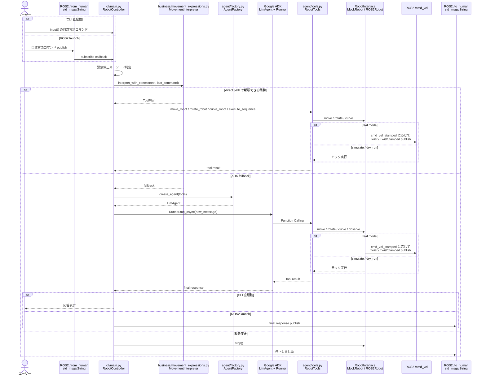
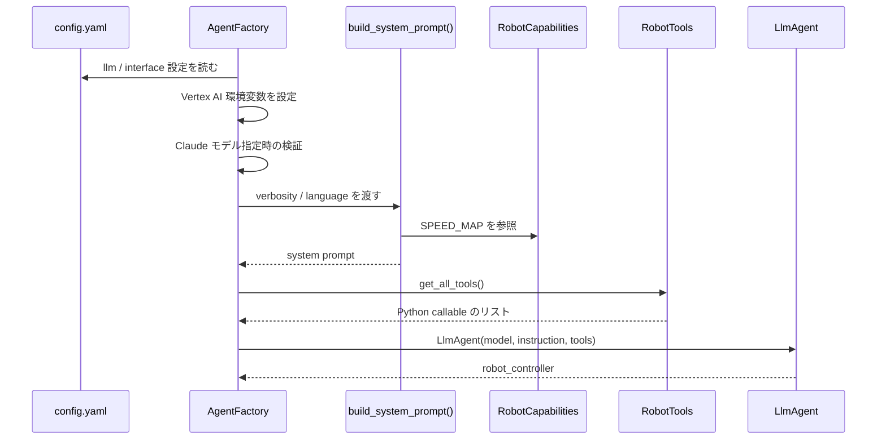
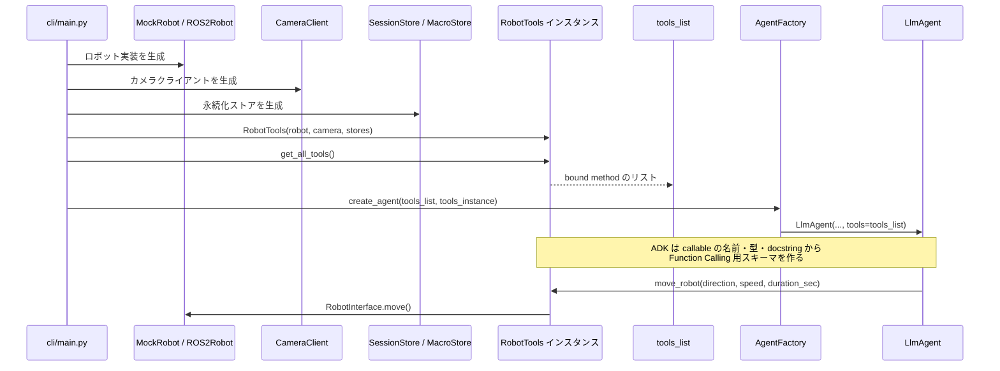
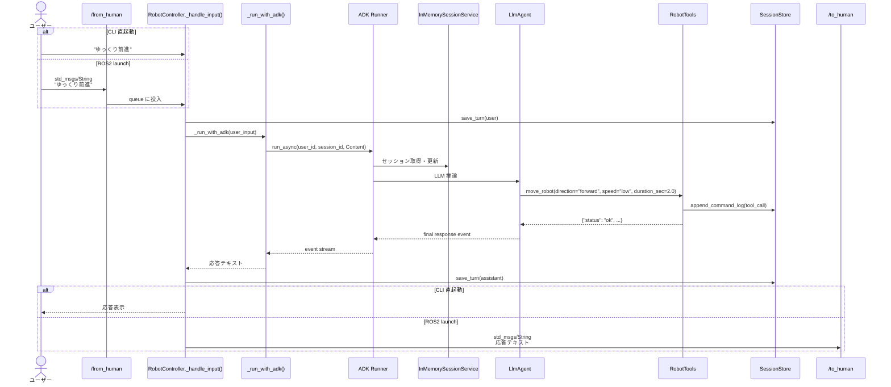
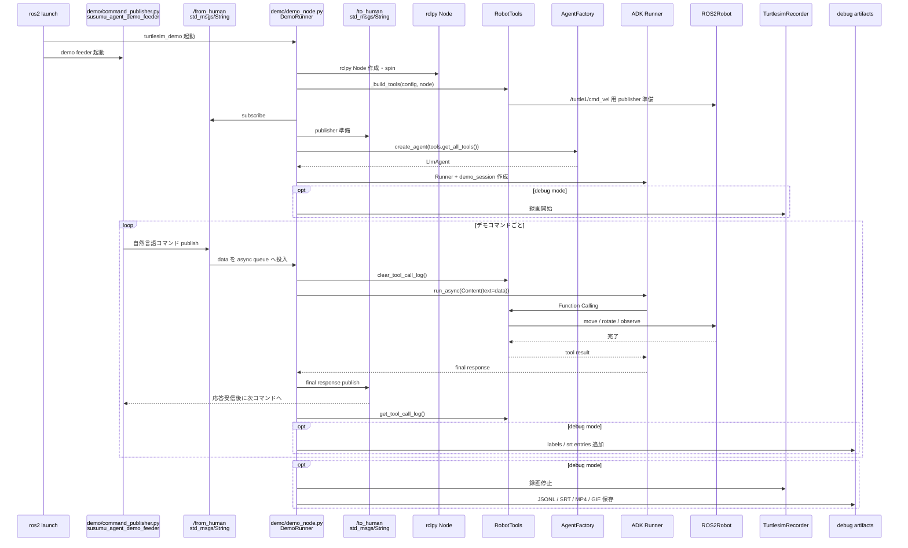
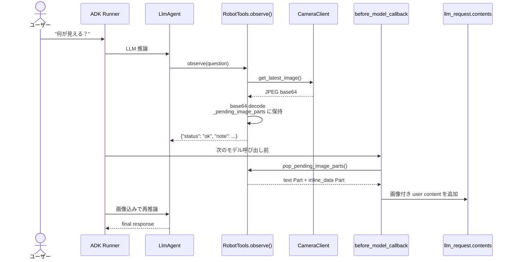

# ADK 連携メモ

このドキュメントは、`susumu_agent` が Google ADK とどのように関わり、自然言語の入力をロボット操作へ変換しているかをまとめたものです。

## ADK の役割

このリポジトリでの ADK は「direct path で解釈できない自然言語を解釈し、適切な Python 関数を Function Calling で呼び出す fallback 層」です。
明確な移動表現は先に `business/movement_expressions.py` の `MovementInterpreter` が `ToolPlan` に変換し、ADK を使わず `RobotTools` を直接呼びます。
ロボットの実際の制御、安全状態、ROS2 との接続は ADK の外側にあり、ADK から見える操作面は `RobotTools` のメソッドだけです。

大まかな流れは次のとおりです。

```text
ユーザー入力
  -> CLI 直起動: input()
  -> ROS2 launch: /from_human (std_msgs/String)
  -> cli/main.py または demo/demo_node.py
  -> cli/main.py では MovementInterpreter が direct path を試す
  -> direct path で解釈できない場合のみ ADK へ fallback
  -> AgentFactory が LlmAgent を生成
  -> ADK Runner.run_async()
  -> LlmAgent が Function Calling で RobotTools を呼ぶ
  -> RobotTools が RobotInterface 経由で MockRobot / ROS2Robot を操作
  -> 人間向け応答は ROS2 launch では /to_human (std_msgs/String) に publish
```



緊急停止キーワードは例外です。`cli/main.py` が `EMERGENCY_KEYWORDS` を先に判定し、ADK を通さず即座に `stop_event` と `robot.stop()` を実行します。

## 依存関係

ADK 本体は `pyproject.toml` の `google-adk>=2.1.0,<3.0.0` で管理されています。Vertex AI の認証・モデル利用には次の前提があります。

- `.env` または環境変数で `GOOGLE_CLOUD_PROJECT` を設定する
- `config.yaml` の `llm.location` を使って `GOOGLE_CLOUD_LOCATION` を設定する
- `AgentFactory` が `GOOGLE_GENAI_USE_VERTEXAI=TRUE` を設定する
- Gemini は `config.yaml` の `llm.model` に `gemini-2.5-flash` などを指定する
- Claude on Vertex AI を使う場合は、ADK の `Claude` を `LLMRegistry` に登録できる環境が必要

## ADK エージェントの生成

ADK エージェントの生成は `susumu_agent/agent/factory.py` の `AgentFactory.create_agent()` に集約されています。

主な処理は次の順です。

1. `config.yaml` の `llm` と `interface` 設定を読む
2. Vertex AI 用の環境変数を設定する
3. Claude モデル指定時は `LLMRegistry.register(Claude)` 済みか検証する
4. `build_system_prompt()` でシステムプロンプトを生成する
5. `LlmAgent(name="robot_controller", model=..., instruction=..., tools=...)` を作る
6. カメラ画像を扱うため、必要なら `before_model_callback` を登録する

`LlmAgent` に渡される `tools` は `RobotTools.get_all_tools()` が返す Python メソッドのリストです。ADK は各メソッドの型アノテーションと docstring を見て、Function Calling 用のスキーマを組み立てます。

ここで渡しているのは JSON Schema を手書きした設定ではなく、`RobotTools` インスタンスに束縛された Python callable そのものです。たとえば通常 CLI では次の順で組み立てます。

```python
camera = CameraClient(...)
tools = RobotTools(
    robot=self._robot,
    camera=camera,
    session_store=SessionStore(),
    macro_store=MacroStore(),
)

agent = AgentFactory(config).create_agent(
    tools.get_all_tools(),
    tools_instance=tools,
)
```

`tools.get_all_tools()` は次のような bound method のリストを返します。

```python
[
    tools.move_robot,
    tools.rotate_robot,
    tools.execute_sequence,
    tools.observe,
    tools.query_status,
    tools.query_last_command,
    tools.manage_macro,
    tools.report_unsupported,
]
```

`AgentFactory.create_agent()` はこのリストをそのまま `LlmAgent` の `tools` 引数に渡します。

```python
LlmAgent(
    name="robot_controller",
    model=model,
    instruction=system_prompt,
    tools=tools_list,
)
```

ADK に渡る tool 情報は、各メソッドから読み取れる次の情報です。

| 情報源 | ADK が使う内容 | 例 |
|---|---|---|
| メソッド名 | tool 名 | `move_robot` |
| 型アノテーション | 引数型・選択肢 | `direction: Literal["forward", "backward", "stop"]` |
| デフォルト値 | 省略時の値 | `speed="medium"`, `duration_sec=2.0` |
| docstring | tool の説明、引数説明 | `ロボットを前進・後退・停止させる` |
| 戻り値 | 実行結果として LLM に返る dict | `{"status": "ok", ...}` |

一方、`robot`、`camera`、`session_store`、`macro_store` は ADK に直接渡していません。これらは `RobotTools` インスタンスの内部状態として保持され、ADK が `tools.move_robot(...)` のように bound method を呼んだときに、そのメソッド内から利用されます。





## システムプロンプト

システムプロンプトは `susumu_agent/agent/prompt.py` の `build_system_prompt()` が生成します。

ここでは次の内容を LLM に伝えています。

- 安全・倫理ルール
- ロボットができること、できないこと
- 速度マッピング
- 日本語・英語の返答言語
- 返答の詳しさ
- 能力範囲内なら操作ツール、能力範囲外なら `report_unsupported` を呼ぶこと

速度値は `business/capabilities.py` の `RobotCapabilities.SPEED_MAP` から自動的に埋め込まれます。そのため速度定義を変えると、ADK に渡すプロンプトにも同じ値が反映されます。

## ADK Runner の呼び出し

通常の対話 CLI では `susumu_agent/cli/main.py` が ADK を呼びます。`python3 -m susumu_agent` の直起動では端末の `input()` から入力しますが、ROS2 launch 経由では `input("あなた: ").strip()` を使わず、`/from_human` (`std_msgs/msg/String`) の `data` を ADK への入力として受け取ります。

起動時の流れは次のとおりです。

```text
RobotController.run()
  -> _setup_robot()
  -> _setup_tools()
  -> _setup_adk()
  -> ROS2 launch の場合は /from_human subscribe と /to_human publisher を準備
```

`_setup_adk()` は `AgentFactory` で `LlmAgent` を作り、`InMemorySessionService` に `session_001` を作成します。ADK は利用できる前提のため、import や初期化に失敗した場合はエラーとして扱います。

入力ごとの呼び出しは `_run_with_adk()` です。

```python
runner = Runner(agent=self._agent, session_service=self._session_service, app_name="robot_nl")
content = Content(role="user", parts=[Part(text=user_input)])

async for event in runner.run_async(
    user_id="operator",
    session_id=self._session_id,
    new_message=content,
):
    ...
```

`runner.run_async()` はイベントをストリーミングで返します。現在の実装では `event.is_final_response()` の最終応答だけを集めて、ユーザーに表示する文字列にしています。途中の tool call イベントは通常 CLI では直接表示していませんが、ツール側の `loguru` ログとデバッグ時の command log に残ります。

ROS2 launch 時は、最終応答として集めた人間向け文字列を `/to_human` (`std_msgs/msg/String`) に publish します。ツール呼び出しの内部イベントや `/cmd_vel` の値は `/to_human` には流さず、ログとデバッグ成果物に残します。



## turtlesim デモでの呼び出し

`susumu_agent/demo/demo_node.py` も ADK を使います。デモでは最初に `Runner` を作って使い回しますが、デモ内容はこのノード内で直接ループ実行しません。`susumu_agent_demo_feeder` が `/from_human` にデモ用の自然言語入力を publish し、`demo_node.py` は通常の ROS2 入力と同じように受信して ADK へ渡します。

正方形デモは `DemoCommand.interrupt_after_sec=5.0` で、feeder が5秒後に `ストップ` を1回だけ `/from_human` に publish します。デモコマンド一覧の末尾には別の固定 `ストップ` を入れないため、字幕にも STOP は1回だけ出ます。最後の `/to_human` 応答後は `final_hold_sec`（デフォルト5秒）待ってから feeder が終了し、launch 全体が shutdown します。

```text
DemoRunner.run()
  -> _build_tools()
  -> /from_human subscribe と /to_human publisher を準備
  -> _setup_adk()
  -> /from_human の data を受けるたび _run_command() を実行
```

`_setup_adk()` は `demo_session` を作り、`Runner(agent=..., session_service=..., app_name="robot_nl")` を返します。`_run_command()` は `Content(role="user", parts=[Part(text=cmd)])` を作り、`runner.run_async()` の最終応答を取り出します。

デバッグモードでは `RobotTools` が記録した tool call ログを字幕や JSONL ラベルに使います。
短いコマンドの字幕は最低2秒表示されるように、SRT の終了時刻を補正します。



## Function Calling で呼ばれるツール

ADK に公開されるツールは `susumu_agent/agent/tools.py` の `RobotTools.get_all_tools()` で定義されています。

| ツール | 役割 |
|---|---|
| `move_robot` | 前進・後退・停止 |
| `rotate_robot` | その場旋回 |
| `curve_robot` | 前進・後退しながら左右にカーブ |
| `execute_sequence` | 複数ステップの移動・旋回・カーブ |
| `observe` | カメラ画像取得 |
| `query_status` | 現在の移動状態取得 |
| `query_last_command` | 直前コマンド取得 |
| `manage_macro` | マクロ登録・実行・削除・一覧 |
| `report_unsupported` | 能力外指示の報告 |

具体例として、`move_robot` は次のシグネチャと docstring を持っています。

```python
async def move_robot(
    direction: Literal["forward", "backward", "stop"],
    speed: Literal["low", "medium", "high"] = "medium",
    duration_sec: float = 0.0,
) -> dict:
    """ロボットを前進・後退・停止させる。

    Args:
        direction: 移動方向。forward=前進、backward=後退、stop=停止。
        speed: 速度。low=ゆっくり、medium=標準、high=素早く。
        duration_sec: 継続時間（秒）。0.0=ストップ指示まで継続、0.1〜30.0。stop の場合は無視される。
    """
```

この情報から、ADK は `move_robot` という tool に `direction`、`speed`、`duration_sec` という引数があり、`direction` と `speed` は指定された候補から選ぶべきだと判断できます。
ただし `cli/main.py` では「ゆっくり3秒前進」のような明確な移動表現は direct path で処理されるため、ADK は主に direct path で扱わない入力の fallback として使われます。
ADK が同じ入力を扱う場合、概念的には次のような tool call を作ります。

```json
{
  "name": "move_robot",
  "args": {
    "direction": "forward",
    "speed": "low",
    "duration_sec": 3.0
  }
}
```

ADK はこの tool call を Python の bound method 呼び出しに変換し、`await tools.move_robot(direction="forward", speed="low", duration_sec=3.0)` のように実行します。

各ツールは ADK から呼ばれる入口であると同時に、ロボット制御層への境界でもあります。たとえば `move_robot()` は次を行います。

1. `duration_sec` を `clamp_duration()` で制限する
2. tool call をログに残す
3. `SharedState.last_command` を更新する
4. デバッグ時は `SessionStore.append_command_log()` に記録する
5. `stop_event` が立っていれば実行せず `aborted` を返す
6. `RobotInterface.move()` を呼び、MockRobot または ROS2Robot を動かす

つまり ADK は直接 `/cmd_vel` を publish しません。ADK から呼ばれる Python 関数が、ロボット抽象の `RobotInterface` に処理を委譲します。ROS2 実機モードでは `robot.cmd_vel_stamped` または launch の `cmd_vel_stamped` パラメータに応じて、`geometry_msgs/msg/Twist` か `geometry_msgs/msg/TwistStamped` を publish します。

## 画像 observe の扱い

`observe()` はカメラ画像を ADK に渡すための特別な実装になっています。

`CameraClient.get_latest_image()` は JPEG の base64 文字列を返しますが、`observe()` はその画像を tool result の dict に直接入れません。代わりに `RobotTools._pending_image_parts` に `google.genai.types.Part` として保持します。

その後、`AgentFactory` が登録した `before_model_callback` が次の LLM リクエスト直前に `_pending_image_parts` を取り出し、`llm_request.contents` に画像付きの user content を追加します。

この形にしている理由は、`InMemorySessionService` がセッションを `deepcopy` するためです。大きな画像バイナリを共有状態やセッション側に載せるとコピーが重くなるため、ツールインスタンス上の一時領域に置いてから callback で注入しています。



## セッションと履歴

ADK の会話セッションは `InMemorySessionService` で管理されます。

- 通常 CLI: `app_name="robot_nl"`, `user_id="operator"`, `session_id="session_001"`
- turtlesim デモ: `app_name="robot_nl"`, `user_id="demo"`, `session_id="demo_session"`

一方、`storage/session_store.py` の `SessionStore` は ADK セッションとは別の永続化です。通常のユーザー入力と応答を `session_history.jsonl` に保存し、デバッグ時には tool call を `{ts}_command_log.jsonl` に保存します。

現状の通常 CLI では、過去ターンを ADK の `new_message` に明示的に再注入していません。文脈はプロセス内の `InMemorySessionService` が保持するセッションに依存します。

## 安全境界

安全上重要な境界は三つあります。

1. `cli/main.py` の緊急停止判定は ADK より前に実行される
2. `RobotTools` は `stop_event` を見て、緊急停止中なら移動を中断する
3. `MockRobot` と `ROS2Robot` は動作完了後に必ず速度を 0 に戻す

direct path も ADK fallback も最終的には同じ `RobotTools` を通るため、停止判定、`last_command` 更新、ロボット抽象への委譲は同じ境界で処理されます。

LLM の判断は便利な入力解釈のために使いますが、実際の制御・停止・状態管理は ADK の外側に置かれています。

## 新しいツールを追加する手順

新しい ADK tool を追加する場合は、基本的に `RobotTools` だけを編集します。

1. `RobotTools` に `async def` または通常の `def` メソッドを追加する
2. 引数に型アノテーションを付ける
3. docstring に Args を書く
4. `get_all_tools()` の返り値に追加する
5. 必要なら `build_system_prompt()` に使い方と制約を追記する
6. 共有状態、ログ、安全制約が必要なら既存ツールと同じ形で処理する

ADK への登録は `get_all_tools()` のリスト経由なので、`AgentFactory` 側の変更は通常不要です。

## 関連ファイル

| ファイル | 内容 |
|---|---|
| `susumu_agent/cli/main.py` | 通常 CLI、ADK 初期化、Runner 実行 |
| `susumu_agent/demo/demo_node.py` | turtlesim デモでの ADK Runner 利用 |
| `susumu_agent/agent/factory.py` | `LlmAgent` 生成、Vertex AI 環境変数、Claude 登録、画像 callback |
| `susumu_agent/agent/prompt.py` | ADK に渡すシステムプロンプト |
| `susumu_agent/agent/tools.py` | Function Calling で呼ばれるツール群 |
| `susumu_agent/business/capabilities.py` | 速度・角度・緊急停止キーワードなどの能力定義 |
| `susumu_agent/business/shared_state.py` | stop event、last command、twist 状態 |
| `susumu_agent/robot/interface.py` | ADK tool から先のロボット抽象 |
| `susumu_agent/robot/mock_robot.py` | ROS2 なしのシミュレーション実装 |
| `susumu_agent/robot/ros2_robot.py` | ROS2 `/cmd_vel` publish 実装（`cmd_vel_stamped` で Twist / TwistStamped 切り替え） |
| `susumu_agent/sensors/camera.py` | `observe()` 用の画像取得 |
