# susumu_agent 設計ドキュメント

---

## 目次

- [1. システム概要](#1-システム概要)
- [2. 仕様](#2-仕様)
  - [2.1 動作モード](#21-動作モード)
  - [2.2 ロボット能力定義](#22-ロボット能力定義)
  - [2.3 ツール一覧](#23-ツール一覧)
  - [2.4 自然言語解釈ルール](#24-自然言語解釈ルール)
  - [2.5 安全仕様](#25-安全仕様)
  - [2.6 入出力インターフェース](#26-入出力インターフェース)
- [3. アーキテクチャ](#3-アーキテクチャ)
  - [3.1 全体構成図](#31-全体構成図)
  - [3.2 コンポーネント一覧](#32-コンポーネント一覧)
  - [3.3 データフロー](#33-データフロー)
  - [3.4 スレッドモデル](#34-スレッドモデル)
- [4. 実装](#4-実装)
  - [4.1 ファイル構成](#41-ファイル構成)
  - [4.2 設定ファイル（config.yaml）](#42-設定ファイルconfigyaml)
  - [4.3 依存パッケージ](#43-依存パッケージ)
  - [4.4 LLM・ADK 設計](#44-llmadk-設計)
  - [4.5 システムプロンプト設計](#45-システムプロンプト設計)
  - [4.6 コードアーキテクチャ](#46-コードアーキテクチャ)
- [5. 運用](#5-運用)
  - [5.1 起動方法](#51-起動方法)
  - [5.2 デプロイ](#52-デプロイ)
  - [5.3 ログ・デバッグ](#53-ログデバッグ)
  - [5.4 テスト戦略](#54-テスト戦略)
  - [5.5 モデル更新フロー](#55-モデル更新フロー)
  - [5.6 コスト管理](#56-コスト管理)
- [6. 拡張・制約](#6-拡張制約)
  - [6.1 将来拡張の方針](#61-将来拡張の方針)
  - [6.2 プライバシー・倫理](#62-プライバシー倫理)
  - [6.3 フィールド運用オプション](#63-フィールド運用オプション)
  - [6.4 未決事項](#64-未決事項)

---

## 1. システム概要

自然言語（日本語・英語）でロボットを制御するシステム。
ユーザーが「ゆっくり前進して」「右に90度回転して」などと入力すると、
明確な移動表現は business 層の `MovementInterpreter` が LLM なしで `ToolPlan` に変換する。
曖昧な指示、カメラ確認、マクロ操作など direct path で扱わない入力は Google ADK の LlmAgent にフォールバックし、Function Calling でロボットへの動作指令に変換する。

**技術スタック：**

| 要素 | 採用技術 |
|---|---|
| エージェントフレームワーク | Google ADK（`google-adk>=2.1.0`） |
| LLM（デフォルト） | Gemini 2.5 Flash（Vertex AI） |
| LLM（オプション） | Claude on Vertex AI（Model Garden で有効化が必要） |
| ロボット制御 | ROS2（`/cmd_vel` トピックへ Twist / TwistStamped をパブリッシュ） |
| 言語 | Python 3.10+ |
| パッケージ管理 | uv |

---

## 2. 仕様

### 2.1 動作モード

`config.yaml` の `robot.mode` で切り替える。

| モード | ROS2 | ロボット指令 | 用途 |
|---|---|---|---|
| `simulate` | 不要 | MockRobot がログ表示 | 開発・動作確認（デフォルト） |
| `real` | 必要 | `/cmd_vel` に Twist / TwistStamped をパブリッシュ | 実機運用 |
| `dry_run` | 不要 | なし（LLM のみ動かす） | プロンプト調整 |

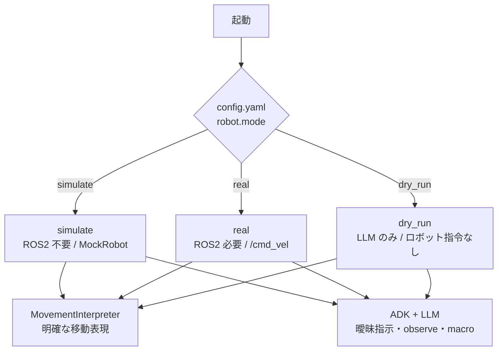

---

### 2.2 ロボット能力定義

**対応コマンド（ホワイトリスト）：**

| 操作 | パラメータ | 例 |
|---|---|---|
| 前進 | speed / duration_sec | 「ゆっくり3秒前進」 |
| 後退 | speed / duration_sec | 「少し後退して」 |
| 停止 | — | 「止まれ」 |
| 旋回 | angle_deg / speed | 「右に90度回転」 |
| カーブ走行 | direction / turn / speed / duration_sec | 「右カーブしながら前進」 |
| シーケンス | 複数ステップ | 「三角形を描いて」 |
| カメラ確認 | question | 「前方に何がある？」 |
| 状態確認 | — | 「今動いてる？」 |
| 直前コマンド参照 | — | 「さっきと同じ動きを」 |
| マクロ登録・実行 | name / steps | 「この動きをAとして登録」 |

**速度マッピング（`capabilities.py` の `RobotCapabilities.SPEED_MAP` が唯一の定義源）：**

| speed | キーワード例 | linear (m/s) | angular (rad/s) |
|---|---|---|---|
| `low` | ゆっくり / ゆったり / slowly | 0.1 | 0.3 |
| `medium` | 指定なし（デフォルト） | 0.3 | 0.8 |
| `high` | 素早く / 速く / fast | 0.5 | 1.5 |

**旋回 duration の計算：**

```
duration_sec = abs(radians(angle_deg)) / angular_vel
```

旋回精度は角速度×時間の理論値。スリップ・摩擦による誤差があり、精度が必要な場合はエンコーダーフィードバックを別途実装すること。

**対応しないコマンド（`report_unsupported` を呼ぶ）：**

| 例 | 理由 |
|---|---|
| 「コップを取って」 | マニピュレーター未定義 |
| 「充電ステーションへ戻って」 | 自律ナビゲーション未定義 |
| 「地図を作って」 | SLAM 未定義 |
| 「人を追いかけて」 | 安全・倫理ルール違反 |

---

### 2.3 ツール一覧

ADK が Function Calling で呼び出すツール、および direct path が直接呼び出すツール。`tools.py` の `RobotTools` クラスに実装。

| # | ツール | シグネチャ | 役割 |
|---|---|---|---|
| 1 | `move_robot` | `(direction, speed, duration_sec)` | 直進・後退・停止 |
| 2 | `rotate_robot` | `(angle_deg, speed, continuous, duration_sec)` | 旋回（角度指定・継続・時間指定） |
| 3 | `curve_robot` | `(direction, turn, speed, duration_sec)` | 前進・後退しながら左右にカーブ |
| 4 | `execute_sequence` | `(steps: list[dict], loop)` | 複数ステップ連続実行・進捗追跡 |
| 5 | `observe` | `(question, sensor)` | カメラ画像取得（解析は LLM が行う） |
| 6 | `query_status` | `()` | 現在の移動状態 |
| 7 | `query_last_command` | `()` | 直前コマンド参照 |
| 8 | `manage_macro` | `(action, name, steps)` | マクロ登録・実行・削除・一覧 |
| 9 | `report_unsupported` | `(reason)` | 能力範囲外を通知 |

ツールのパラメータ境界値：

| パラメータ | 許容範囲 | 超過時 |
|---|---|---|
| `speed` | `low` / `medium` / `high` のみ | ADK スキーマ違反で拒否 |
| `direction` | `forward` / `backward` / `stop` のみ | ADK スキーマ違反で拒否 |
| `duration_sec` | `0.0`=継続 / `0.1〜30.0` 秒 | clamp（上限30秒）。`0.0` のみ特殊値 |
| `angle_deg` | `-360〜+360` 度 | clamp。正=左回り、負=右回り |
| `continuous` | `true` / `false` | `true` の場合はストップ指示まで旋回継続 |

---

### 2.4 自然言語解釈ルール

**速度キーワード：**

| speed | キーワード |
|---|---|
| `low` | ゆっくり / ゆったり / ちょっとずつ / ちょい / そろそろ / のんびり / 少し / slowly / gently |
| `medium` | 普通 / 通常 / 指定なし |
| `high` | 素早く / 速く / ダッシュ / 全力 / 急いで / fast / quickly |

明確な移動表現は `business/movement_expressions.py` の `MovementInterpreter` で LLM なしに解釈する。
未対応・曖昧な入力は ADK/LLM にフォールバックする。

**時間・距離変換：**

| 入力 | 変換 |
|---|---|
| 「3秒前進」 | `duration_sec = 3.0` |
| 「三秒前進」 | `duration_sec = 3.0` |
| 「50cm前進」 | `duration = 0.5 / speed_linear` 秒 |
| 「五十センチ前進」 | `duration = 0.5 / speed_linear` 秒 |
| 「1メートル動いて」 | `duration = 1.0 / speed_linear` 秒 |
| 「一メートル動いて」「半メートル動いて」 | 漢数字・半を距離として解釈 |
| 「3歩分進んで」 | 1歩 = 0.5m として計算 |
| 時間・距離の指定なし | `duration_sec = 0.0`（ストップ指示があるまで継続） |

**旋回の方向・角度解釈：**

| 入力 | `angle_deg` | 動作 |
|---|---|---|
| 「右を向いて」「右向け」 | `-90` | 右に90度で止まる |
| 「左を向いて」「左向け」 | `90` | 左に90度で止まる |
| 「後ろを向いて」「振り向いて」 | `180` | 180度で止まる |
| 「45度回転」「90度旋回」「九十度旋回」など角度明示 | その角度 | 指定角度で止まる |
| 「左旋回して」「くるくる回って」など角度なし | `continuous=true`, `angle_deg=1.0` | ストップ指示があるまで左回りで継続 |

正値 = 左回り、負値 = 右回り。

**コンテキスト参照：**

| 入力 | 解釈 |
|---|---|
| 「さっきと同じ動きを」「もう一回」 | `SharedState.last_command` を再実行 |
| 「逆方向に戻って」「反対方向」 | 直前 direction / turn / angle_deg を反転 |
| 「さっきより速く」「もっと速く」 | 直前 speed を1段階上げる |
| 「さっきより遅く」「もっとゆっくり」 | 直前 speed を1段階下げる |

同じ入力に明示的な移動指示が含まれる場合は、文脈再実行より明示指示を優先する。
例: 「さっきより速く前進して」は直前コマンドではなく、`前進` を `high` で実行する。

**曖昧指示：**

| 入力パターン | 解釈 |
|---|---|
| 「もうちょっと」「少し」 | speed=`low`, duration_sec=1.0 |
| 解釈不能な相対指示 | 「どのくらいですか？」と確認 |

条件付き指示（「〜なければ〜して」）は `report_unsupported` を呼ぶ。
日本語・英語・ローマ字・口語・敬語・命令形すべてを受け付ける。

---

### 2.5 安全仕様

**安全レイヤー：**

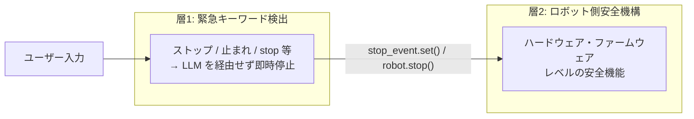

| レイヤー | 仕組み | 発動条件 |
|---|---|---|
| ① 緊急停止 | `stop_event`（threading.Event） | 「ストップ」「止まれ」等のキーワード |
| ② 外部安全機構 | ハードウェア・ファームウェア | 障害物・転倒等 |

**倫理ガードレール（システムプロンプト最優先）：**

1. 人物・動物への突進・追跡指示 → `report_unsupported`
2. 「壊して」「ぶつけて」「攻撃して」等の破壊的指示 → `report_unsupported`
3. 緊急停止を無効化する指示 → `report_unsupported`

---

### 2.6 入出力インターフェース

**入力：** CLI 直起動ではテキスト入力、ROS2 launch では `/from_human` (`std_msgs/msg/String`)。

**ROS2 入出力：**

| 方向 | トピック | 型 | 説明 |
|---|---|---|---|
| Subscribe | `/from_human` | `std_msgs/msg/String` | 人間から ADK へ渡す自然言語入力（ROS2 launch 時） |
| Subscribe | `/camera/image_raw` | `sensor_msgs/msg/Image` | `observe()` 用のカメラ画像 |
| Publish | `/to_human` | `std_msgs/msg/String` | ロボットの応答テキスト（下記仕様参照） |
| Publish | `/cmd_vel` | `geometry_msgs/msg/Twist` | 速度指令（`cmd_vel_stamped: false`） |
| Publish | `/cmd_vel` | `geometry_msgs/msg/TwistStamped` | タイムスタンプ付き速度指令（`cmd_vel_stamped: true`） |

`robot.cmd_vel_stamped` は bool で、`true` の場合は `TwistStamped`、`false` の場合は `Twist` を publish する。launch ファイルの `cmd_vel_stamped` パラメータで上書きできる。

ROS2 launch 経由では `input("あなた: ").strip()` を使わない。`cli/main.py` は launch から起動されたときに `interface.input_mode=ros2` として動作し、`/from_human` の `data` をまず `MovementInterpreter` に渡す。direct path で解釈できない場合のみ ADK Runner へ渡す。

**`/to_human` 送信仕様：**

コマンドの種類によって送信タイミングと回数が異なる。

| コマンド種別 | 送信タイミング | 回数 | 内容 |
|---|---|---|---|
| direct path の移動・旋回・シーケンス | ツール呼び出し直前 | 1回 | `ToolPlan.announcement`（「前進します」など） |
| ADK 経由の移動・旋回・マクロ等 | ツール呼び出し直前（LLM の宣言テキスト） | 1回 | 「前進します」「右に旋回します」など |
| `observe`（カメラ確認） | ① ツール呼び出し直前 | 2回 | ① 「カメラで確認します」など |
| | ② LLM の最終応答（画像解析結果） | | ② 「前方に段差が見えます」など |
| 緊急停止 | 即時 | 1回 | 「停止しました。」 |

起動時に `/to_human` へのウェルカムメッセージは送信しない。

**フィードバック：**

| タイミング | 内容 |
|---|---|
| ツール呼び出し直前（direct path announcement または LLM 宣言） | 「前進します」「右に旋回します」など |
| observe 解析完了時 | 「前方に〜が見えます」など画像解析結果 |
| 緊急停止時 | 「停止しました。」 |
| エラー時 | エラー内容（LLM 応答内） |

**起動時メッセージ：** `help` / 「ヘルプ」 で LLM を経由せず能力一覧を表示。

**verbosity 設定：**

| 設定値 | 返答スタイル |
|---|---|
| `brief` | 「了解」「前進します」など極短文 |
| `normal` | 速度・時間を含む1〜2文（デフォルト） |
| `verbose` | 実行内容・速度・時間・完了後の状態を詳述 |

---

## 3. アーキテクチャ

### 3.1 全体構成図

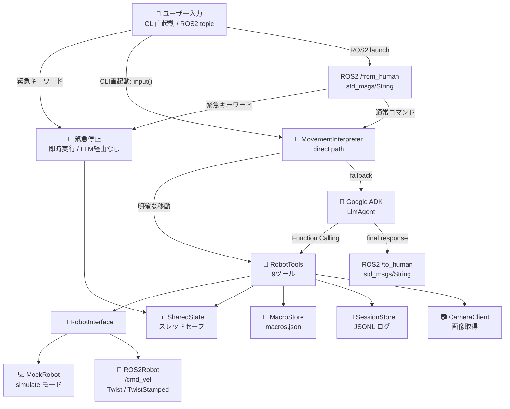

---

### 3.2 コンポーネント一覧

| コンポーネント | ファイル | 責務 |
|---|---|---|
| エントリポイント | `cli/main.py` | 入力ループ・緊急停止検出・direct path・ADK Runner 起動 |
| ADK エージェント | `agent/factory.py` | LlmAgent 定義・モデル設定 |
| ツール実装 | `agent/tools.py` | 9ツール（RobotTools クラス） |
| システムプロンプト | `agent/prompt.py` | LLM 向けプロンプト生成 |
| 能力・定数定義 | `business/capabilities.py` | 速度定数・キーワード（RobotCapabilities クラス） |
| 移動表現解釈 | `business/movement_expressions.py` | 表現カタログ・MovementInterpreter・golden ケース |
| 共有状態 | `business/shared_state.py` | SharedState シングルトン・スレッド安全な状態管理 |
| カメラ | `sensors/camera.py` | Image Subscriber・base64変換・鮮度チェック |
| セッション管理 | `storage/session_store.py` | セッション履歴・コマンドログ JSONL |
| マクロ管理 | `storage/macro_store.py` | マクロ登録・読み込み（macros.json） |
| ROS2 ロガーブリッジ | `logging/ros_logger.py` | loguru → rclpy.logging（RosLogger クラス） |
| ロボット抽象 | `robot/interface.py` | RobotInterface 抽象クラス |
| 実機実装 | `robot/ros2_robot.py` | ROS2 / Twist・TwistStamped パブリッシュ |
| モック実装 | `robot/mock_robot.py` | simulate / dry_run モード用 |
| デバッグ CLI | `cli/debug_tools.py` | LLM なしで direct path の解釈確認・ツール直接テスト |
| デモノード | `demo/demo_node.py` | `/from_human` を受けて turtlesim デモを実行・録画・字幕生成 |
| デモ入力ノード | `demo/command_publisher.py` | turtlesim デモ用の自然言語入力を `/from_human` に publish |
| 録画ユーティリティ | `demo/recorder.py` | ffmpeg x11grab による画面録画 |

---

### 3.3 データフロー

**通常コマンド（direct path）：**

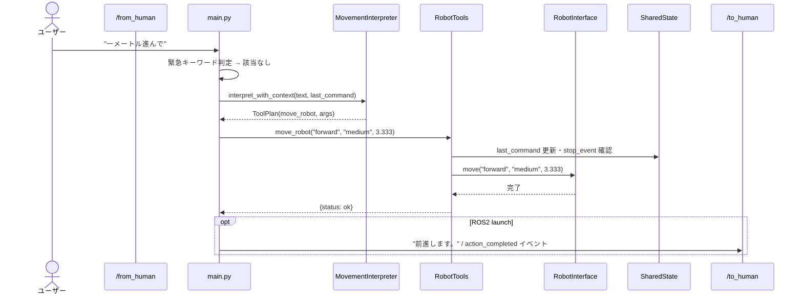

**通常コマンド（ADK fallback）：**

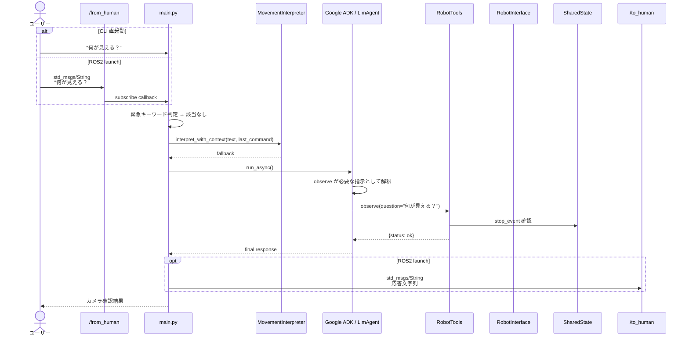

**緊急停止：**

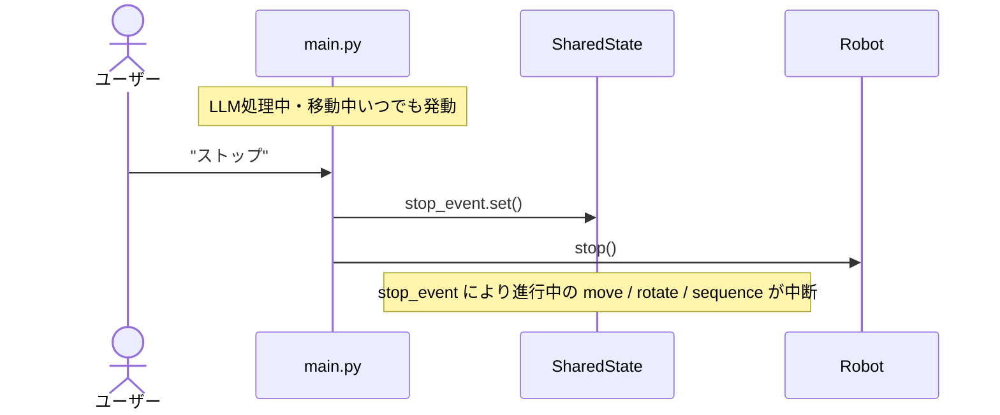

**observe フロー：**

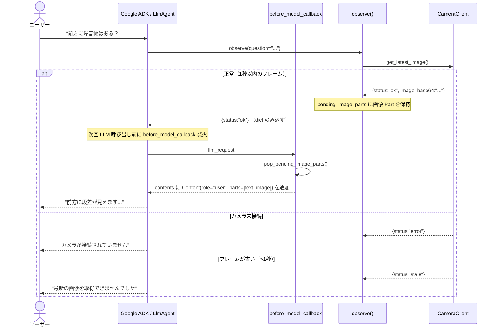

---

### 3.4 スレッドモデル

**スレッド構成：**

| スレッド | 役割 |
|---|---|
| メインスレッド | CLI 入力または `/from_human` キュー処理・緊急停止検出・ADK Runner（asyncio） |
| ROS2スレッド | `rclpy.spin()`、`/from_human` callback、`/to_human` publish、cmd_vel publisher |

**共有状態の保護：**

| 変数 | 保護方法 |
|---|---|
| `_twist` | `threading.Lock` で read/write を保護 |
| `last_command_time` | `threading.Lock` で保護 |
| `stop_event` | `threading.Event`（スレッドセーフ） |
| `shutdown_event` | `threading.Event`（スレッドセーフ） |

**stop_event のライフサイクル：**

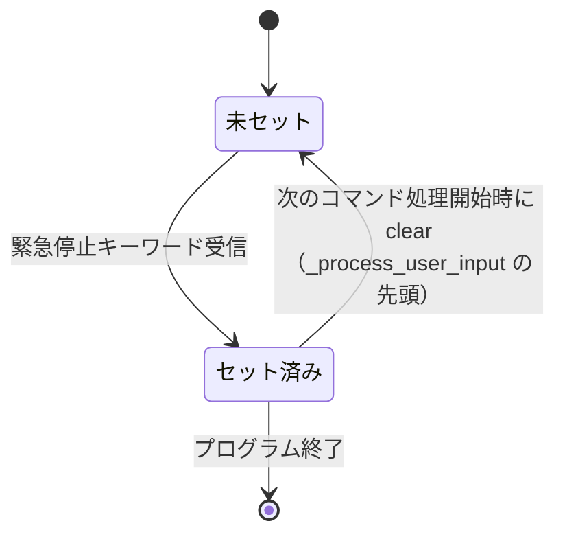

緊急停止後は `stop_event` がセットされたままになるが、次のコマンドが `/from_human` に届いた時点で `_process_user_input` の先頭で `stop_event.clear()` を呼ぶため、通常コマンドは即座に動作を再開できる。緊急キーワードが来た場合のみ再度 `stop_event.set()` する。

**シャットダウン順序：**

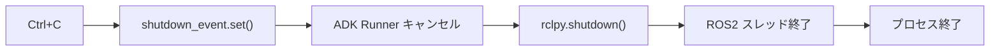

**execute_sequence の割り込み：**

```python
for step in steps:
    if stop_event.is_set():   # 各ステップ開始前にチェック
        break
    execute_step(step)
```

---

## 4. 実装

### 4.1 ファイル構成

```
susumu_agent/
├── config.yaml               # 全設定（トピック・モデル・モード等）
├── pyproject.toml            # 依存定義（uv 管理）
├── .env                      # 認証情報（gitignore 対象）
├── .env.sample               # .env テンプレート
├── debug/                    # デバッグ出力先（gitignore 対象）
│   ├── {ts}_susumu_agent.log
│   ├── {ts}_command_log.jsonl
│   ├── {ts}_demo_labels.jsonl
│   ├── {ts}_turtlesim_raw.mp4
│   ├── {ts}_turtlesim.srt
│   ├── {ts}_turtlesim.mp4
│   └── {ts}_turtlesim.gif
├── launch/
│   ├── mock.launch.py
│   ├── mock_debug.launch.py
│   ├── real.launch.py
│   ├── real_debug.launch.py
│   ├── turtlesim.launch.py
│   ├── turtlesim_debug.launch.py
│   ├── turtlesim_demo.launch.py
│   └── turtlesim_demo_debug.launch.py
├── tests/                    # ROS2 不要の pytest
│   ├── test_capabilities.py
│   ├── test_debug_tools.py
│   ├── test_movement_expressions.py
│   └── test_tools_sequence_state.py
└── susumu_agent/
    ├── business/             # ビジネスロジック中核（ROS2・ADK 依存ゼロ）
    │   ├── capabilities.py   # RobotCapabilities（速度定数・キーワード）
    │   ├── movement_expressions.py # 表現カタログ・direct path 解釈・golden ケース
    │   └── shared_state.py   # SharedState シングルトン
    ├── agent/                # LLM エージェント層
    │   ├── factory.py        # AgentFactory / LlmAgent 定義
    │   ├── tools.py          # RobotTools（9ツール実装）
    │   └── prompt.py         # build_system_prompt()
    ├── storage/              # 永続化層
    │   ├── session_store.py  # SessionStore
    │   └── macro_store.py    # MacroStore
    ├── sensors/              # センサー系
    │   └── camera.py         # CameraClient
    ├── logging/              # ログ基盤
    │   └── ros_logger.py     # RosLogger（loguru → ROS2 ブリッジ）
    ├── demo/                 # turtlesim デモ・録画（ROS2 専用）
    │   ├── demo_node.py      # DemoRunner（/from_human を受けて turtlesim 実行）
    │   ├── command_publisher.py # デモ入力を /from_human に publish
    │   ├── commands.py       # デモコマンド定義
    │   └── recorder.py       # TurtlesimRecorder（ffmpeg x11grab）
    ├── cli/                  # CLIエントリポイント
    │   ├── main.py           # 入力ループ・緊急停止・フィードバック表示
    │   └── debug_tools.py    # DebugRunner（direct path 解釈確認・LLM なし直接テスト CLI）
    ├── voice/                # 音声 I/F（抽象クラスのみ）
    │   ├── recognizer.py     # BaseSpeechRecognizer 抽象クラス
    │   └── synthesizer.py    # BaseSynthesizer 抽象クラス
    └── robot/                # ロボット抽象化
        ├── interface.py      # RobotInterface 抽象クラス
        ├── ros2_robot.py     # ROS2Robot
        └── mock_robot.py     # MockRobot
```

---

### 4.2 設定ファイル（config.yaml）

```yaml
robot:
  namespace: ""                   # 複数台時は "/robot_a" 等を設定
  cmd_vel_topic: "/cmd_vel"
  cmd_vel_stamped: true           # true=TwistStamped / false=Twist
  image_topic: "/camera/image_raw"
  battery_topic: ""               # 空の場合は無視
  battery_low_threshold: 20
  battery_critical_threshold: 10
  watchdog_timeout_sec: 5.0
  max_duration_sec: 30.0
  max_angle_deg: 360.0
  ramp_down_enabled: true
  ramp_down_steps: 5
  mode: "simulate"                # real / simulate / dry_run
  compliance_mode: false
  human_presence_max_speed: 0.25

llm:
  model: "gemini-2.5-flash"       # gemini-2.5-flash / gemini-2.5-pro / claude-sonnet-4-5@20250514
  project: "your-project-id"
  location: "asia-northeast1"
  backend: "vertex_ai"
  timeout_sec: 5
  timeout_observe_sec: 10
  retry_max: 1
  backoff_base_sec: 1.0

interface:
  language: "auto"                # ja / en / auto
  from_human_topic: "/from_human" # ROS2 launch 時の自然言語入力
  to_human_topic: "/to_human"     # ROS2 launch 時の人間向け応答
  verbosity: "normal"             # brief / normal / verbose
  feedback_modes: ["text"]
  camera_send_to_cloud: true

auth:
  mode: "none"                    # none / single_token / multi_user
  token: ""

cost_control:
  daily_command_limit: 500
  daily_observe_limit: 50
  alert_threshold_usd: 10.0
```

**変更時の影響局所化：**

| 変更内容 | 変更箇所 |
|---|---|
| モデル文字列の更新 | `config.yaml` の `llm.model` 1行のみ |
| ROS2 トピック変更 | `config.yaml` の `robot.cmd_vel_topic` 1行のみ |
| ROS2 入出力トピック変更 | `config.yaml` の `interface.from_human_topic` / `interface.to_human_topic` |
| ROS2 cmd_vel 型変更 | `config.yaml` の `robot.cmd_vel_stamped`、または launch parameter |
| 速度パラメータ調整 | `capabilities.py` の `RobotCapabilities.SPEED_MAP` のみ |
| 緊急停止キーワード追加 | `capabilities.py` の `RobotCapabilities.EMERGENCY_KEYWORDS` のみ |

**launch ファイルの `cmd_vel_stamped` デフォルト：**

| launch | `cmd_vel_stamped` | cmd_vel 型 |
|---|---:|---|
| `mock.launch.py` / `mock_debug.launch.py` | `true` | `geometry_msgs/msg/TwistStamped` |
| `real.launch.py` / `real_debug.launch.py` | `true` | `geometry_msgs/msg/TwistStamped` |
| `turtlesim.launch.py` / `turtlesim_debug.launch.py` | `false` | `geometry_msgs/msg/Twist` |
| `turtlesim_demo.launch.py` / `turtlesim_demo_debug.launch.py` | `false` | `geometry_msgs/msg/Twist` |

**turtlesim デモ固有の launch パラメータ：**

| パラメータ | デフォルト | 説明 |
|---|---:|---|
| `final_hold_sec` | `5.0` | 最後の `/to_human` 応答後、shutdown まで待つ秒数 |

デモ入力は `demo/commands.py` の `DEMO_COMMANDS` で定義する。正方形デモは `interrupt_after_sec=5.0` を持ち、`demo/command_publisher.py` が5秒後に `ストップ` を1回だけ `/from_human` に publish する。末尾に固定の `ストップ` コマンドは置かないため、SRT 字幕にも STOP は1回だけ出る。

---

### 4.3 依存パッケージ

**pyproject.toml（`uv sync` でインストール）：**

| パッケージ | バージョン | 用途 |
|---|---|---|
| `google-adk` | `>=2.1.0,<3.0.0` | ADK 本体 |
| `anthropic[vertex]` | `>=0.50.0,<1.0.0` | Claude on Vertex AI |
| `google-cloud-aiplatform` | `>=1.90.0,<2.0.0` | Vertex AI 認証 |
| `opencv-python` | `>=4.9.0,<5.0.0` | カメラ画像処理 |
| `pyyaml` | `>=6.0,<7.0` | 設定ファイル読み込み |
| `loguru` | `>=0.7.0,<1.0.0` | ログ出力 |
| `python-dotenv` | `>=1.0.0,<2.0.0` | .env 読み込み |

**ROS2 付属（pip 不可）：**

| パッケージ | 取得方法 |
|---|---|
| `rclpy` | ROS2 インストール済み環境 |
| `geometry_msgs` | ROS2 インストール済み環境 |
| `sensor_msgs` | ROS2 インストール済み環境 |

`pyproject.toml` にメジャーバージョン上限付きで依存を定義し、`uv.lock` で再現可能ビルドを保証。週1回 `pip-audit` でセキュリティ脆弱性チェックを実施。

---

### 4.4 LLM・ADK 設計

**モデル設定（`config.yaml` の `llm.model` で一元管理）：**

| モデル | 前提 |
|---|---|
| `gemini-2.5-flash`（デフォルト） | Vertex AI 有効化のみ |
| `gemini-2.5-pro` | Vertex AI 有効化のみ |
| `claude-sonnet-4-5@20250514` | Vertex AI Model Garden で Claude を有効化 |

Claude を使う場合は `agent.py` が `LLMRegistry.register(Claude)` を自動実行する。

**認証（.env ファイルで管理）：**

```dotenv
GOOGLE_CLOUD_PROJECT=your-project-id
```

`agent.py` が `load_dotenv()` で読み込み、`GOOGLE_GENAI_USE_VERTEXAI=TRUE` は自動設定される。

**ADK 固有の実装方針：**

- 全ツールを `async def` で実装。`duration` の待機は `asyncio.sleep` を使用（イベントループをブロックしない）
- `runner.run_async()` でストリーミング実行し、`tool_call` イベントをフィードバック表示に活用
- `LLMRegistry.register(Claude)` はモジュールロード時（`agent.py` 先頭）に実行

**カメラ画像の LLM への渡し方：**

Vertex AI Gemini は `FunctionResponse.parts` に `inline_data` を付けることを非対応（`400 INVALID_ARGUMENT`）。
代わりに `before_model_callback` で `llm_request.contents` に `Content(role="user", parts=[image_part])` を追加する方式を採用。

```
observe() → RobotTools._pending_image_parts に画像 Part を保持
          → before_model_callback が pop して llm_request.contents に追加
          → LLM が画像を user Content として受け取り解析
```

`InMemorySessionService` の `_copy_session` が `copy.deepcopy(session)` を呼ぶため、
session state に大きなバイナリを保持するとハングする（ADK issue #3064）。
`tools` インスタンス変数で保持することでこの問題を回避している。

**ROS2 QoS 設定：**

```python
qos = QoSProfile(
    reliability=ReliabilityPolicy.RELIABLE,
    durability=DurabilityPolicy.VOLATILE,
    history=HistoryPolicy.KEEP_LAST,
    depth=10,
)
```

安全機構側のサブスクライバーとの QoS 互換性を実装時に確認すること。

---

### 4.5 システムプロンプト設計

`agent/prompt.py` の `build_system_prompt()` が唯一の定義源。
速度定数（`business/capabilities.py` の `RobotCapabilities.SPEED_MAP` 等）を変更するとプロンプトに自動反映される。

**プロンプト優先順位：**

```
1. 安全・倫理ルール（最優先・絶対）
2. できること（能力ホワイトリスト）
3. できないこと
4. 解釈ルール（速度・時間・距離・言語）
5. 返答フォーマット
```

---

### 4.6 コードアーキテクチャ

**`RobotInterface` で ROS2 への依存を逆転：**

```
robot/
├── interface.py    # 抽象クラス（ROS2 依存ゼロ）
├── ros2_robot.py   # 実機実装
└── mock_robot.py   # simulate / dry_run モード用
```

**`SharedState` クラスで全共有変数を集約（シングルトン）：**

```python
@dataclass
class SharedState:
    _twist: TwistValue
    _lock: threading.Lock
    stop_event: threading.Event
    shutdown_event: threading.Event
    last_command: dict | None

    @classmethod
    def instance(cls) -> SharedState: ...
```

**`RobotCapabilities` クラスで定数・ロジックを集約（`business/capabilities.py`）：**

```python
class RobotCapabilities:
    SPEED_MAP: dict            # 速度定数の唯一の定義源
    EMERGENCY_KEYWORDS: frozenset
    SPEED_KEYWORDS: dict

    @classmethod
    def clamp_duration(cls, value: float) -> float: ...
    @classmethod
    def angle_to_duration(cls, angle_deg: float, speed: SpeedLevel) -> float: ...
```

システムプロンプト生成は `agent/prompt.py` の `build_system_prompt()` に分離。定数を変更するとプロンプトに自動反映される。

---

## 5. 運用

### 5.1 起動方法

```bash
# シミュレーション（ROS2 不要）
python3 -m susumu_agent

# 設定ファイルを指定
python3 -m susumu_agent /path/to/config.yaml

# ROS2 launch（通常）
ros2 launch susumu_agent mock.launch.py
ros2 launch susumu_agent real.launch.py
ros2 launch susumu_agent turtlesim.launch.py
ros2 launch susumu_agent turtlesim_demo.launch.py

# cmd_vel 型の明示指定
ros2 launch susumu_agent real.launch.py cmd_vel_stamped:=true       # TwistStamped
ros2 launch susumu_agent turtlesim.launch.py cmd_vel_stamped:=false # Twist

# ROS2 launch（デバッグ：ログ・録画を debug/ に保存）
ros2 launch susumu_agent mock_debug.launch.py
ros2 launch susumu_agent real_debug.launch.py
ros2 launch susumu_agent turtlesim_demo_debug.launch.py

# LLM なしで自然言語の direct path 解釈を確認
python3 -m susumu_agent.cli.debug_tools parse "一メートル進んで"
python3 -m susumu_agent.cli.debug_tools parse "逆方向" \
  --last-command '{"tool":"move_robot","direction":"forward","speed":"medium","duration_sec":2.0}'

# LLM なしでツールを直接実行
python3 -m susumu_agent.cli.debug_tools move forward medium 2.0
python3 -m susumu_agent.cli.debug_tools rotate 90 medium
python3 -m susumu_agent.cli.debug_tools sequence square
python3 -m susumu_agent.cli.debug_tools --real --cmd-vel-topic /turtle1/cmd_vel move forward medium 2.0
```

---

### 5.2 デプロイ

systemd サービス化により電源 ON で自動起動・クラッシュ時自動再起動。
GCP 資格情報は `/etc/robot_nl/secrets.env`（`chmod 600`）で管理。

**障害・リカバリ：**

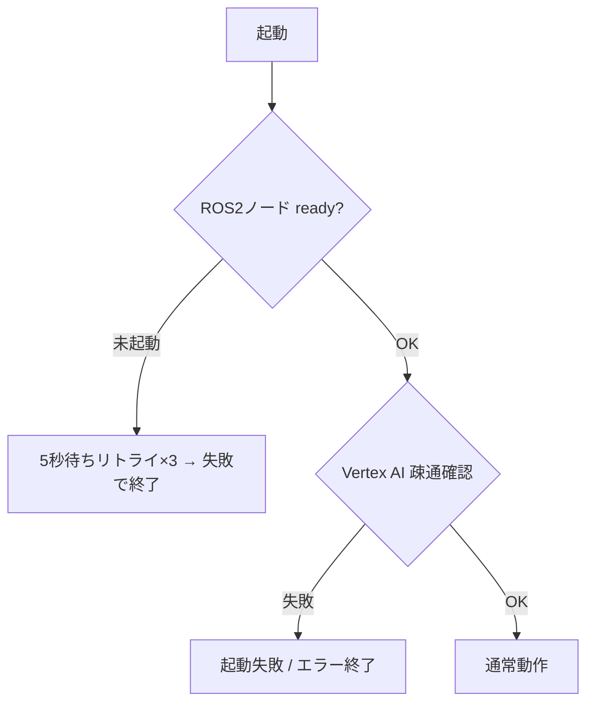

| 障害 | 対応 |
|---|---|
| Vertex AI タイムアウト | 再試行1回 → エラー通知 → ロボット停止 |
| Vertex AI 完全障害 | 起動失敗またはエラー終了 |
| ROS2 ノード未起動 | 起動失敗で終了 |
| カメラ切断 | observe のみ失敗、移動は継続 |

---

### 5.3 ログ・デバッグ

**ログレベル：**

| レベル | 記録内容 |
|---|---|
| `INFO` | ユーザー入力・ツール名・応答テキスト・cmd_vel 値 |
| `DEBUG` | LLM 生レスポンス・パラメータ詳細・レイテンシ |
| `WARNING` | clamp 発動・stale カメラ・再試行 |
| `ERROR` | API エラー・ROS2 エラー・タイムアウト |

**デバッグモード出力ファイル（`debug/` フォルダ）：**

| ファイル | 内容 |
|---|---|
| `{ts}_susumu_agent.log` | loguru ログ（通常ノード） |
| `{ts}_susumu_agent_demo.log` | loguru ログ（デモノード） |
| `{ts}_command_log.jsonl` | ツール呼び出し履歴 |
| `{ts}_demo_labels.jsonl` | 指示・応答のラベル情報（デモ時のみ） |
| `{ts}_turtlesim_raw.mp4` | turtlesim 元録画（デモ時のみ） |
| `{ts}_turtlesim.srt` | 字幕ファイル・日本語＋英語（デモ時のみ、短い字幕は最低2秒表示） |
| `{ts}_turtlesim.mp4` | 字幕付き動画（デモ時のみ） |
| `{ts}_turtlesim.gif` | アニメーション GIF・480px（デモ時のみ） |

```bash
# debug_dir を変更して起動
ros2 launch susumu_agent turtlesim_demo_debug.launch.py debug_dir:=/tmp/mydbg
```

**構造化ログ形式（command_log.jsonl）：**

```json
{"ts": "2026-06-07T12:34:56", "level": "INFO", "event": "tool_call", "tool": "move_robot", "params": {"direction": "forward", "speed": "low", "duration_sec": 2.0}}
{"ts": "2026-06-07T12:35:00", "level": "INFO", "event": "tool_result", "status": "ok", "latency_ms": 1823}
{"ts": "2026-06-07T12:35:01", "level": "WARN", "event": "clamp", "param": "duration_sec", "original": 99.0, "clamped": 30.0}
```

---

### 5.4 テスト戦略

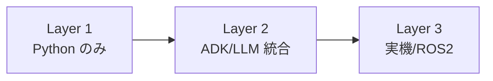

| レイヤー | 環境 | テスト内容 | 頻度 |
|---|---|---|---|
| Layer 1 | Python のみ（ROS2 不要） | 速度マッピング・duration 計算・clamp・MovementInterpreter golden・debug CLI | PR 毎 |
| Layer 2 | Python + ADK/LLM | fallback 経路・observe・macro・report_unsupported 判定 | 必要時 |
| Layer 3 | ROS2 / 実機 / turtlesim | `/cmd_vel` 型・topic I/O・デモ録画 | リリース前 |

**必須テストケース（Layer 1）：**

| テスト | 確認内容 |
|---|---|
| 速度マッピング | low=0.1 / medium=0.3 / high=0.5 |
| 旋回計算 | 90°・180°・360° の duration 精度 |
| clamp | duration=99→30.0 / angle=720→360.0 |
| 移動表現 golden | 追加表現が期待 tool / args に変換されること |
| 文脈参照 | もう一回・逆方向・速度変更が `last_command` から正しく変換されること |
| CLI parse | `debug_tools parse` が JSON で direct/fallback を返すこと |

```bash
pytest                                              # 全テスト
pytest tests/test_capabilities.py -v               # capabilities のみ
pytest tests/test_movement_expressions.py -v       # direct path golden のみ
```

---

### 5.5 モデル更新フロー

1. 新モデル文字列を `config-staging.yaml` に設定
2. direct path の `pytest` を実行し、LLM に依存しない移動表現の基準が維持されていることを確認する
3. ADK/LLM を使う fallback 経路（observe、macro、unsupported など）を代表入力で確認する
4. 全件パスで `config.yaml` に反映。失敗時はプロンプト調整またはロールバック

モデル文字列は `config.yaml` の `llm.model` のみで管理する。

```bash
# 利用可能なモデルを確認
gcloud ai models list --region=asia-northeast1
```

---

### 5.6 コスト管理

```yaml
cost_control:
  daily_command_limit: 500    # コマンド上限
  daily_observe_limit: 50     # observe 上限
  alert_threshold_usd: 10.0   # アラートしきい値
```

上限到達時は追加コマンドを受け付けず、管理者への通知またはエラー応答で扱う。

**トークン節約の方針：**

| 対策 | 方法 |
|---|---|
| セッション履歴上限 | 直近5ターンのみ保持 |
| observe 画像縮小 | 送信前に 640×480 へリサイズ（OpenCV） |

**応答時間目標：**

| 処理 | 目標 | 超過時 |
|---|---|---|
| LLM 応答（単純コマンド） | 3秒以内 | 再試行1回 → エラー |
| LLM 応答（observe） | 5秒以内 | エラー通知 |

---

## 6. 拡張・制約

### 6.1 将来拡張の方針

**マルチロボット対応：** 現設計は 1ユーザー × 1ロボットを対象。将来拡張は namespace で対応。

```yaml
robot:
  namespace: ""   # 複数台時は "/robot_a" 等を設定
```

**センサー拡張：** `observe(sensor="camera"|"lidar"|"ultrasonic")` の sensor パラメータで拡張。`SensorBase` 抽象クラスを定義し実装を分離。

**音声 I/F：** `voice/` モジュール（`BaseSpeechRecognizer` / `BaseSynthesizer`）を継承して実装。音声認識レイヤーでも緊急停止キーワードを LLM 経由なしで検出すること。

**アクセス制御（オプション）：**

```yaml
auth:
  mode: "none"   # none / single_token / multi_user
```

**モニタリング（オプション）：** Prometheus メトリクス（`robot_commands_total` / `robot_api_latency_seconds` / `robot_emergency_stops_total` 等）を `/metrics` で公開。緊急停止が5分で3回以上の場合にアラート。

---

### 6.2 プライバシー・倫理

- カメラ画像は送信前に顔検出＋ブラー処理（OpenCV）を適用（`camera_send_to_cloud: false` で無効化可）
- ユーザー入力テキストはログの DEBUG レベルのみ記録（INFO には残さない）
- 画像 base64 はログに残さない
- セッション履歴の保存期間は24時間
- `compliance_mode: true` で移動速度を 0.25 m/s 以下に制限（ISO/TS 15066 参考値）

---

### 6.3 フィールド運用オプション

- **バッテリー残量連携（オプション）：** 20% で警告、10% で移動禁止
- **スタック検知（オプション）：** cmd_vel 送信中に `/odom` が変化しない場合、停止＋通知
- **減速ランプ（`ramp_down_enabled: true`）：** 停止時に5ステップで段階的に速度を下げる（衝撃軽減）

---

### 6.4 未決事項

| 項目 | 状態 | アクション |
|---|---|---|
| Vertex AI 利用可能なモデル文字列 | 未確定 | 実装時 `gcloud ai models list --region=asia-northeast1` で確認後 config.yaml に記載 |
| ADK の multimodal tool_result の書き方 | **解決済み** | `before_model_callback` で `llm_request.contents` に追加（Vertex AI は `function_response.parts` 非対応のため） |
| runner.run_async / run_live の API | **解決済み** | `runner.run_async()` を使用。`InMemorySessionService` + `Runner` の組み合わせで動作確認済み |
| 顔検出ブラーの精度・パフォーマンス | 要検証 | OpenCV の軽量モデル選定 |
| 禁止パターンの具体的なリスト | 要定義 | 実装時に確定 |
| バッテリートピックのメッセージ型 | 要確認 | 使用ロボットに依存 |
| スタック検知の `/odom` トピック型 | 要確認 | 使用ロボットに依存 |
